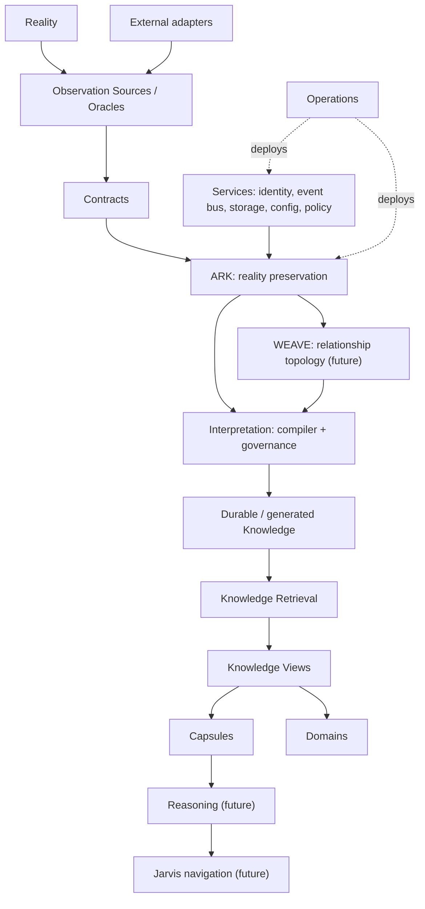
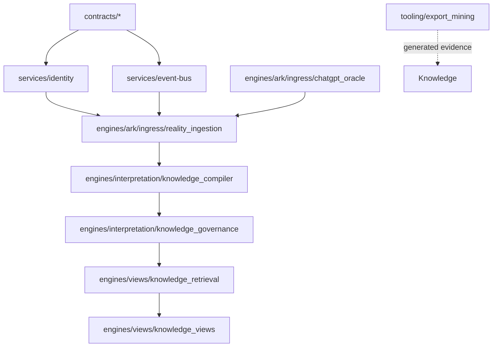

# Wayfinder Repository Architectural Analysis

Date: 2026-07-05

Status: analysis only. No runtime implementation changes are proposed as
immediate work in this document.

## Executive Architecture Summary

Wayfinder is not a greenfield repository. It is a constitutional monorepo that
preserves architecture, contracts, folded legacy systems, implementation
proofs, and generated knowledge artifacts under one governance model.

The strongest architectural direction is already explicit:

- Reality and evidence precede interpretation.
- Concepts have one canonical home.
- Services own reusable infrastructure.
- Engines own unique responsibilities.
- Legacy implementations are preserved until extraction proof exists.
- Durable knowledge is promoted only through proof and governance.

The current repository contains three different kinds of material:

1. **Constitutional architecture** in `WAYFINDER.md`, `constitution/`,
   `canon/`, `contracts/`, and governance docs.
2. **Implemented proof slices** in `services/`, `engines/ark/ingress/`,
   `engines/interpretation/`, `engines/views/`, and `tooling/export_mining/`.
3. **Preserved historical systems and derived evidence** in
   `engines/*/legacy/`, `.wayfinder-validation/`, and `Knowledge/`.

This is healthy for an actively migrating architecture, but it creates one
central risk: readers can confuse preserved legacy, generated knowledge, and
canonical runtime ownership. The architecture already has the right rule for
this: classify by responsibility, preserve history, then extract common
behavior into services or contracts only after proof.

## Repository Map

| Area | Observed Responsibility | Current Maturity | Notes |
| --- | --- | --- | --- |
| `WAYFINDER.md` | Constitutional foundation and laws | Canonical | Defines stack, laws, and engine lifecycle. |
| `constitution/` | Immutable architectural doctrine | Canonical | Owns laws, CivPhys, assets, execution, repository, architecture. |
| `canon/` | Semantic kernel and naming registry | Canonical | Richest glossary and ontology source. |
| `contracts/` | Boundary language crossing ownership seams | Stage 1+ | Contracts contain no runtime code. |
| `services/` | Reusable platform infrastructure | Mixed | Identity and Event Bus have implementation proofs; Storage, Configuration, Policy are scaffolds. |
| `engines/` | Unique architectural responsibilities | Mixed | ARK, Interpretation, Views have proof code; many engines are placeholders or legacy folds. |
| `capabilities/` | Architectural verbs/outcome language | Early | Present as a top-level owner, not yet a mature runtime registry. |
| `domains/` | Domain-specific orchestration | Placeholder | No substantial domain implementations yet. |
| `internal/` | Internal applications | Placeholder | No active app surface in current tracked files. |
| `external/` | External integration homes | Placeholder | Actual integrations mostly remain in legacy folds. |
| `operations/` | Deployment/runtime operations | Placeholder | Operations coupling still largely in ARK legacy. |
| `tooling/` | Developer/generated tooling | Active | Export mining and compiler tooling live here. |
| `Knowledge/` | Generated knowledge base and indexes | Generated artifact | Derived from export evidence; not raw source. |
| `.wayfinder-validation/` | Local ignored validation evidence | Local/private | Not tracked; used for source manifests and first-contact outputs. |
| `docs/` | Governance, ADRs, audits, roadmaps | Active | Contains debt register, maturity model, migration dashboard, previous phase reports. |

## Domain Map



## Dependency Graph

Observed active Python import analysis, excluding `legacy/`:

- Active Python files: 38.
- Legacy Python files: 199.
- Active internal import edges: 28.
- Active service-to-engine violations: 0.
- Active contract-to-implementation violations: 0.

The implemented active graph broadly follows the constitutional direction:



Important nuance: `tooling/export_mining` is not currently an engine. It is a
developer/compiler tool that operates over ChatGPT export evidence and emits
`Knowledge/` artifacts. If this becomes a runtime ingestion path, it should be
reclassified or split so source observation remains with Observation Sources
and generated indexes remain disposable.

## First-Class Concept Inventory

| Concept | Canonical Home | Observed Responsibility | Maturity | Overlap / Consolidation Note |
| --- | --- | --- | --- | --- |
| Reality | `WAYFINDER.md`, `constitution/laws.md` | External truth before representation | Canonical | Foundational. |
| Observation | `contracts/observations/` | Source-shaped record before interpretation | Canonical | Observation Sources produce; ARK preserves. |
| Observation Source / Oracle | `canon/ontology.md`, `constitution/architecture.md` | Discover, parse, validate source material | Canonical | ChatGPT Oracle is first concrete source. |
| Evidence | `contracts/evidence/` | Traceable support for claims | Canonical | Must remain separate from proof. |
| Provenance | `contracts/provenance/` | Traceability fields and source linkage | Canonical | Cross-cutting; present in all working pipelines. |
| Representation | `contracts/representations/` | Derived view/projection of preserved material | Canonical | Must not become source truth. |
| Asset / RID | `constitution/assets.md`, `contracts/assets/`, `services/identity/` | Asset identity and reference model | Stage 1-2 | RID model still needs vertical slice. |
| ARK | `engines/ark/` | Append-only preservation, replay, LVR | Stage 1-2 | Modern ingress proof exists; legacy holds much behavior. |
| LVR | ARK docs/models | Last Verified Reality cursor | Implemented in ARK ingestion | Strong preservation boundary. |
| Source Relationship | `contracts/relationships/`, ARK docs | Explicit source edge before topology | Canonical | Must remain distinct from WEAVE topology. |
| WEAVE | `engines/weave/` | Durable relationship topology | Stage 0-1 | Not implemented; ARK currently preserves only source edges. |
| Knowledge Compiler | `engines/interpretation/knowledge_compiler/` | Candidate knowledge from ARK records | Stage 2 proof | Separate from export mining compiler tooling. |
| Knowledge Governance | `engines/interpretation/knowledge_governance/` | Human review, approval, promotion records | Stage 2 proof | Needs Candidate Page intake for scale. |
| Knowledge Retrieval | `engines/views/knowledge_retrieval/` | Disposable indexes over promoted knowledge | Stage 2 proof | Should stay rebuildable and non-authoritative. |
| Knowledge Views | `engines/views/knowledge_views/` | Projections/read models | Stage 2 proof | Strong disposable-view boundary. |
| Knowledge Base / `Knowledge/` | Generated docs and graph outputs | Derived export evidence | Generated | Needs clear generated-artifact governance. |
| Capability | `capabilities/`, `contracts/capabilities/`, NOMAD | Stable outcome verb/provider availability | Stage 1 | Capability Registry is not yet mature. |
| Provider / Plugin | Contracts, legacy, future external layer | Replaceable implementations/adapters | Early | Strong candidate for Compatibility Layer. |
| Capsule | `contracts/capsules/`, `engines/capsules/` | Re-entry continuity package | Stage 1 | No concrete runtime proof yet. |
| Jarvis | `engines/jarvis/` | Navigation, bearings, recommendations | Stage 1 / future | Legacy ingress exists but canonical behavior future. |
| Mission / Objective | Canon/glossary, Jarvis/MICE docs | Goal-oriented work context | Early | Needs owner clarification between Jarvis, MICE, Foundry. |
| Foundry | `engines/foundry/` | Engineering change with proof | Stage 1 + legacy fold | Duplicate Forge-origin files with ARK legacy. |
| MICE | `engines/mice/`, commitments contract | Commitments/accountability | Stage 1 | No proof implementation. |
| NOMAD | `engines/nomad/` | Discovery/provider options | Stage 1 | Candidate home for provider discovery registry. |
| VALOR / MIDAS / NetWatch / Blackwall | Engine READMEs | Evaluation, measurement, network, protection | Stage 0-1 | Mostly placeholder boundaries. |
| Runtime Kernel | `docs/implementation-backlog.md` | Shared runtime primitives | Stage 0 implied | Should emerge through service extraction, not as a rewrite. |
| Compatibility Layer | Proposed by this analysis | External adapter isolation | Proposed | Should isolate legacy/external providers. |

## Runtime Candidate Analysis

The repository already has reusable patterns that are not yet centralized:

| Candidate Runtime Service | Evidence | Suggested Canonical Direction |
| --- | --- | --- |
| Structured failure model | `AGENTS.md`, service failures, ingestion failures | Shared runtime contract or service helper after more consumers. |
| Limits/resource caps | ARK ingestion, compiler, governance, retrieval, tooling | Shared `RuntimeLimits` vocabulary, then helper library only if duplication grows. |
| Health signals | Identity, Event Bus, ARK README, service docs | Common `contracts/health/` structures and service health helper. |
| Event sink/publication | Event Bus service, ARK ingestion events, legacy GSB/NATS | Keep Event Bus service canonical; migrate consumers through adapters. |
| Storage abstraction | ARK in-memory storage, governance repository, retrieval store, legacy DuckDB/Redis | Next highest-leverage Stage 2 service proof. |
| Configuration loading/redaction | Legacy ARK/Foundry config, service scaffold | Stage 2 Configuration proof after Storage. |
| Policy/evaluation | Legacy policy engine/MCP policy, service scaffold | Stage 2 Policy proof after Configuration. |
| Search/indexing | Knowledge Retrieval, export compiler SQLite/FTS, legacy search adapters | Extract shared Search/Index service only after promoted-knowledge and export-tooling needs converge. |
| Serialization/to_plain helpers | Many dataclass modules | Small shared helper possible, but low priority until service extraction stabilizes. |
| Time/ID/hash utilities | ARK, services, tooling, legacy | Standardize as runtime utility only after RID and Storage proofs. |

## Duplication Report

Observed tracked duplicate hash groups: 67.

The dominant duplicate family is the Forge-origin preserved legacy body copied
under both:

- `engines/ark/legacy/`
- `engines/foundry/legacy/`

This matches existing debt records DEBT-001 and DEBT-002. It should not be
deleted as a casual cleanup because the duplicate is also historical evidence.
The safe migration is to identify one preserved source-of-record, keep
compatibility aliases or manifest references, and prove that any historical
entry points still resolve.

Other duplication categories:

| Category | Evidence | Risk | Recommendation |
| --- | --- | --- | --- |
| Legacy event infrastructure | ARK event schema, GSB, NATS/WAL, Event Bus proof | High | Continue Event Bus adapter extraction. |
| Storage/persistence | ARK DuckDB/Redis/state, governance repository, retrieval store, SQLite export compiler | High | Prioritize Storage service proof. |
| Configuration | ARK config, Foundry runtime config, env examples, service scaffold | Medium | Extract Configuration after Storage. |
| Policy | ARK policy engine, MCP policy, Policy service scaffold | High | Extract Policy after Configuration. |
| Search/indexing | Knowledge Retrieval and export compiler both create indexes | Medium | Keep separate for now; evaluate shared Search service after retrieval requirements stabilize. |
| Validation/limits | Similar bounded validation in all active modules | Medium | Standardize vocabulary first; helper library later. |
| `to_plain` / serialization | Repeated dataclass conversion helpers | Low | Extract only when shared runtime utilities are accepted. |

## Processing Pipeline Analysis

Current pipelines:

1. **Truth Pipeline**: Reality -> Observation Source -> Observation Contract ->
   ARK -> Interpretation -> Governance -> Retrieval -> Views.
2. **ChatGPT Oracle Pipeline**: export discovery -> artifact classification ->
   parser inventory -> observations/relationships -> validation reports.
3. **ARK Ingestion Pipeline**: validate observations -> resolve identity ->
   preserve observations/source relationships -> update LVR -> emit events.
4. **Knowledge Compiler Pipeline**: ARK preserved observations -> deterministic
   candidates -> novelty/duplicate/contradiction candidates.
5. **Knowledge Governance Pipeline**: candidate intake -> review -> approval ->
   promotion -> promotion records/events.
6. **Knowledge Retrieval Pipeline**: promoted records -> rebuildable indexes ->
   hybrid search/lookup/timeline/related.
7. **Knowledge Views Pipeline**: retrieval/promoted records -> disposable
   projections.
8. **Export Mining Tooling Pipeline**: ChatGPT export files -> generated
   `Knowledge/` graph/docs/search/reports.
9. **Legacy ARK/Foundry Pipelines**: preserved task graph, GSB, emitters,
   Forge loops, MCP/tool/runtime verification.

Universal pipeline opportunity:

```text
Acquire -> Parse -> Normalize -> Validate -> Preserve/Derive ->
Index/View/Report
```

Do not make this a new engine yet. First extract shared stage contracts,
limits, status reporting, and provenance requirements into contracts/services.
Then adapt the existing ChatGPT Oracle and export mining tooling to the shared
stage vocabulary.

## Capability Analysis

Reusable capabilities already visible:

- observation ingestion
- artifact classification
- provenance preservation
- identity resolution
- event publication/replay
- candidate extraction
- governance review/promotion
- full-text/hybrid retrieval
- view projection
- source manifest construction
- graph/search/report generation
- legacy adapter integration
- policy evaluation
- configuration loading
- storage/repository persistence
- health reporting

Capabilities that should become first-class soon:

1. **Storage capability**: preserve object, retrieve object, transaction
   boundary, content hash, metadata, versioning.
2. **Configuration capability**: load, layer, validate, redact, explain source.
3. **Policy capability**: evaluate rule, explain decision, prove gate.
4. **Source adapter capability**: discover, classify, parse, preserve unknowns.
5. **Index capability**: build disposable index, verify provenance, rebuild.

## Architectural Boundaries

| Boundary | Belongs Here | Does Not Belong Here | Recommendation |
| --- | --- | --- | --- |
| Runtime | generic limits, failure model, health, lifecycle status | engine behavior or domain semantics | Define only after multiple Stage 2 services need it. |
| Platform Services | identity, events, storage, config, policy, future telemetry/cache/search | ARK preservation, Jarvis navigation, external provider specifics | Continue service promotion roadmap. |
| Engines | unique responsibilities such as preservation, interpretation, views, navigation | shared logging/storage/config/policy/search | Keep proofs small and service-backed. |
| Domain Plugins | domain workflows using engines/services | canonical platform concepts | Wait until domain evidence exists. |
| Infrastructure / Operations | deployment, broker/database selection, monitoring topology | business rules or canonical contracts | Move ARK legacy ops after parity proof. |
| Adapters / Compatibility Layer | external APIs, provider SDKs, legacy entry points, file formats | canonical semantics or source truth | Introduce as migration layer, not a new source of truth. |
| Generated Knowledge | derived docs, graph chunks, SQLite/FTS indexes | raw export ownership or canonical constitution edits | Keep generated status explicit. |

## Compatibility Analysis

External integrations observed mostly in legacy folds:

- Home Assistant emitters
- Jellyfin emitters
- UniFi emitters
- Docker adapter/status
- web fetch/search adapters
- maps/geocoding/distance adapters
- NATS / Redis / DuckDB / SQLite-like persistence paths
- MCP tools and policy gates
- Ollama/local model clients
- shell scripts, Dockerfiles, compose, deployment scripts
- ChatGPT export files and opaque `.dat` assets

Recommended Compatibility Layer posture:

- External integrations should live under `external/<system>/` or
  `operations/` when deployment-specific.
- Engines should depend on contracts and services, not provider SDKs.
- Provider-specific logic should emit source observations or service requests.
- Legacy entry points should become adapters or documented compatibility shims
  after parity tests.

## Technical Debt Report

| Debt | Existing Evidence | Impact | Priority |
| --- | --- | --- | --- |
| Legacy ARK remains large and active-looking | `engines/ark/legacy/`, DEBT-001 | Readers may mistake preserved source for canonical owner. | High |
| ARK/Foundry Forge duplication | 67 duplicate tracked hash groups, DEBT-002/FC-DEBT-007 | Wasted review surface and ownership ambiguity. | High |
| Storage service lacks Stage 2 proof | `services/storage/README.md`, DEBT-004 | Engines keep local persistence/repository concepts. | High |
| Configuration and Policy are scaffolds | service READMEs, DEBT-006/007 | Runtime behavior remains duplicated in legacy. | Medium-High |
| Candidate scale/gating | FC-DEBT-004/005, Knowledge reports | Governance cannot review export-scale candidates without pages. | High |
| Generated Knowledge size and authority | `Knowledge/` ~220 MB tracked | Could be mistaken for raw truth or hand-authored docs. | Medium |
| Placeholder engine folders | engine README notes, FC-DEBT-008 | Folder presence can look like implementation. | Medium |
| No active domain implementations | `domains/README.md` only | Domain orchestration is conceptual. | Low until domains start. |
| No dependency linter implementation | `tooling/linter/spec.md` only | Drift detection is manual. | Medium |

## Ranked Architectural Opportunities

1. **Storage service implementation proof**: highest leverage because ARK,
   Event Bus, Identity, Governance, Retrieval, Foundry artifacts, and export
   compiler outputs all need storage semantics.
2. **Candidate Page / bounded governance intake**: unblocks real-scale
   knowledge review without weakening proof-before-promotion.
3. **Legacy Forge consolidation plan**: remove duplicate review surface while
   preserving history and compatibility aliases.
4. **Compatibility Layer boundary**: isolate Home Assistant, Jellyfin, UniFi,
   Docker, maps, web, MCP, Ollama, ChatGPT export, and future adapters.
5. **Configuration service proof**: centralizes loading, precedence,
   validation, and redaction.
6. **Policy service proof**: centralizes rule evaluation and promotion/tool
   gates.
7. **Architectural linter implementation**: enforce dependency rules and
   placeholder/legacy classification.
8. **Generated Knowledge governance**: mark generated docs/indexes clearly,
   provide rebuild commands, and prevent manual drift.
9. **Search/Index service evaluation**: compare Knowledge Retrieval and export
   compiler indexing after storage/config/policy mature.
10. **Domain plugin protocol**: defer until one real domain workflow demands it.

## Incremental Migration Roadmap

### Phase 1: Clarify Generated and Legacy Surfaces

- Mark `Knowledge/` as generated, derived, and rebuildable except promoted
  records.
- Add a legacy source-of-record manifest for ARK/Foundry duplicate Forge files.
- Clarify placeholder engine maturity in engine READMEs.

Testability: documentation validation and duplicate hash report.

### Phase 2: Storage Stage 2 Proof

- Inventory existing repository/storage behavior in ARK, Governance,
  Retrieval, Event Bus, Identity, and tooling.
- Define minimal backend-neutral storage primitives.
- Implement service proof with tests.
- Do not rewire consumers yet.

Testability: service tests; no engine behavior changes.

### Phase 3: Candidate Pages

- Define Candidate Page contract and deterministic page identity.
- Add governance intake for pages without changing candidate semantics.
- Prove large-export intake with bounded fixtures.

Testability: governance tests for page replay, partial failures, provenance.

### Phase 4: Configuration Stage 2 Proof

- Extract loading/precedence/redaction behavior from legacy evidence.
- Implement bounded config service primitives.
- Keep provider/deployment config in operations/adapters.

Testability: precedence, redaction, structured failure tests.

### Phase 5: Policy Stage 2 Proof

- Extract reusable rule evaluation from ARK/Foundry policy evidence.
- Keep permissions vocabulary in contracts.
- Prove tool/promotion gate evaluation without rewiring engines.

Testability: deterministic decision and explanation tests.

### Phase 6: Compatibility Layer

- Create adapter classification rules for external systems.
- Move one low-risk integration behind an adapter boundary with parity tests.
- Keep legacy entry points as shims until compatibility is proven.

Testability: adapter contract tests and legacy parity tests.

### Phase 7: Dependency Linter

- Implement the existing `tooling/linter/spec.md`.
- Fail only high-confidence violations first.
- Add warnings for generated/legacy/placeholder ambiguity.

Testability: linter fixtures and CI-safe dry run.

## ADR Recommendations

New ADR drafts are provided for:

- `docs/adrs/0007-storage-service-before-runtime-kernel.md`
- `docs/adrs/0008-compatibility-layer-for-external-integrations.md`
- `docs/adrs/0009-candidate-pages-for-knowledge-governance.md`
- `docs/adrs/0010-legacy-forge-consolidation-with-compatibility-aliases.md`

These ADRs recommend evolution paths only. They do not authorize immediate
runtime rewrites.

## Open Questions

- Should generated `Knowledge/` remain tracked long term, or should large
  indexes move to reproducible artifacts with only manifests tracked?
- Should export mining tooling become an engine, remain tooling, or split into
  Observation Source plus compiler tooling?
- Which legacy Forge location is the authoritative preserved source once
  compatibility aliases exist?
- What is the minimal Storage service proof that satisfies ARK, Governance,
  Retrieval, and export compiler needs without selecting a concrete backend?
- Should Search/Index become a service, or remain split between Knowledge
  Retrieval and tooling until more consumers appear?
