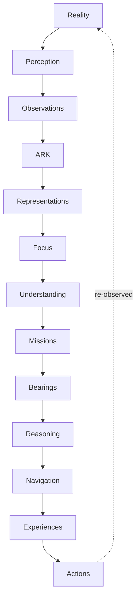

# 00 Overview

Wayfinder is a constitutional continuity platform. Its architecture is ordered
around a strict evidence pipeline:

```text
Reality
-> Perception
-> Observations
-> ARK
-> Representations
-> Focus
-> Understanding
-> Missions
-> Bearings
-> Reasoning
-> Navigation
-> Experiences
-> Actions
```

No upstream dependencies are permitted. Later layers may consume earlier
layers through contracts, services, or generated read models; earlier layers
must not depend on later layers for identity or truth.

## Architectural Principles

- Reality before representation.
- Representation before knowledge.
- Focus before understanding.
- Mission before navigation.
- Navigation before presentation.
- Presentation before action.
- Actions affect reality only.
- Reality is re-observed.
- AI is last, not first.
- Existing capabilities before new implementations.
- Reuse before invention.
- Deterministic before probabilistic.
- Composition before duplication.
- Identity before representation.
- Capability before implementation.
- Progressive discovery before full retrieval.
- Preserve invariants; replace implementations.

## Progressive Discovery

All Wayfinder workflows should retrieve the smallest sufficient
representation needed for the current objective. They should traverse
incrementally, prefer indexes over scans, metadata over content, summaries over
complete documents, relationships over exhaustive traversal, deltas over
rescans, hashes over byte comparisons, and references over duplication.

Retrieval depth escalates only when confidence is insufficient, and traversal
stops when the objective can be satisfied with adequate confidence.

## Current Implementation Posture

Wayfinder currently has strong constitutional and contract architecture,
several Stage 2 proof implementations, large preserved legacy systems, and a
generated knowledge base from ChatGPT export evidence.

Active implementation proofs:

- Identity Service
- Event Bus Service
- ChatGPT Export Oracle
- ARK Reality Ingestion
- Knowledge Compiler
- Knowledge Governance
- Knowledge Retrieval
- Knowledge Views
- Export Mining and Knowledge Compiler tooling

Large future or transitional areas:

- WEAVE relationship topology
- Storage, Configuration, and Policy implementation proofs
- Candidate Page governance intake
- Compatibility Layer for external integrations
- Media Graph and Universal Asset Ingestion
- Jarvis navigation and action pathways

## Canonical Flow


