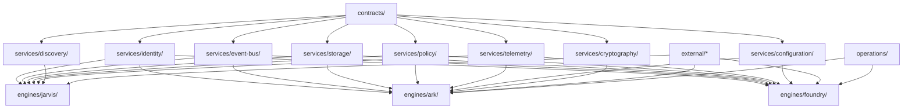

# Constitutional Census

This census covers every engine currently folded into Wayfinder as historical
source material or canonical engine evidence.

Included engines:

- ARK
- Foundry
- Jarvis

Excluded:

- `_template`, because it is an engine scaffold, not a folded engine.

## Method

Inputs:

- Engine READMEs
- ARK Phase 1 reports
- Fold records
- Legacy source filenames and documented module maps
- Existing substrate service contracts

Outputs:

- Concept responsibility map
- Dependency evidence
- Consumer evidence
- Duplication evidence
- Current owner
- Proposed canonical owner
- Confidence level

Constraints:

- No code migration.
- No behavior change.
- No engine refactor.
- Census is evidence for future promotion decisions only.

## ARK Census

ARK is the Wayfinder engine for reality preservation.

Primary responsibility: observation, evidence, provenance, reality graph
behavior, and proof-gated promotion into durable reality.

| Concept | Responsibilities | Dependencies | Consumers | Duplication | Current Owner | Proposed Canonical Owner | Confidence | Evidence |
| --- | --- | --- | --- | --- | --- | --- | --- | --- |
| Reality Preservation | Preserve append-only observations, evidence, provenance, and reality graph continuity. | Contracts, Storage, Event Bus, Identity, Policy, Telemetry. | Engines, domains, internal apps, future query/projection surfaces. | Partly mixed with storage, events, truth spine, and runtime in ARK legacy. | `engines/ark/legacy/` | `engines/ark/` | High | `engines/ark/README.md`, `engines/ark/legacy/ark-core/docs/ARK_TRUTH_SPINE.md` |
| Observation | Accept and record observations before interpretation. | Event contracts, Identity refs, Storage. | ARK reality graph, proofs, projections, domains. | Observation language appeared across ingestion, events, and truth spine; canonical language is now promoted. | `contracts/observations/` for language; ARK legacy remains behavior evidence. | `contracts/observations/` for language, `engines/ark/reality/` for behavior. | High | `contracts/observations/README.md`, `docs/promotions/observation-contract.md`, `engines/ark/docs/extraction-opportunities.md`, `engines/ark/legacy/internal/ingestion/service.go` |
| Evidence | Represent support for claims, validation, and proof decisions. | Observation contracts, Evidence contracts, Policy, TRISCA/measurement. | Proofs, promotion logic, conflict resolution. | Evidence concepts are spread through Bayes, epistemic resolver, TRISCA, proof docs. | ARK legacy. | `contracts/evidence/` for language, `engines/ark/proofs/` for behavior. | High | `engines/ark/docs/extraction-opportunities.md`, `engines/ark/legacy/core/bayes.go`, `engines/ark/legacy/ark-core/internal/epistemic/` |
| Provenance | Trace observations, claims, and promoted records back to sources. | Identity, Event Bus, Storage metadata. | ARK proofs, egress, audit, downstream consumers. | Implied in truth spine and event metadata, not yet one canonical contract. | ARK legacy truth spine. | `contracts/provenance/` for language, `engines/ark/reality/` for behavior. | Medium | `engines/ark/legacy/ark-core/docs/ARK_TRUTH_SPINE.md` |
| Reality Graph | Maintain relationships among artifacts, spans, entities, claims, provenance edges, and SSOT records. | Storage, Identity, Event Bus, Evidence contracts. | Query, projection, navigation, domains. | Overlaps with reference graph service, SSOT, projections, storage classes. | ARK truth spine. | `engines/ark/reality/` with supporting contracts. | High | `engines/ark/legacy/ark-core/docs/ARK_TRUTH_SPINE.md` |
| Promotion Logic | Promote durable knowledge only after proof criteria pass. | Proofs, Policy, Storage transactions, Event Bus. | ARK core, egress, domains. | Promotion schema and implementation exist separately. | `internal/promotion/engine.go`, `internal/contracts/promotion_v1.json`. | `contracts/promotion/` for language, `engines/ark/proofs/` and `engines/ark/core/` for behavior. | High | `engines/ark/docs/extraction-opportunities.md` |
| Ephemeral Projections | Maintain disposable reducers, replay views, temporary graphs, and projections. | Event Bus, Storage read interfaces, Runtime. | Proofs, egress, query surfaces. | Reducers, replay, projections, and indexes are split across Python/Rust/Go. | ARK legacy. | `engines/ark/ephemeral/` | High | `engines/ark/docs/inventory.md`, `engines/ark/legacy/internal/projections/projector.go`, `engines/ark/legacy/ark/reducers.py` |
| SD-ARK Step Loop | Deterministic event-to-action loop: event, resolve delta, score, policy, intent, action, result, meta. | Event Bus, Policy, Action contracts, Measurement. | ARK runtime, API, tests. | Combines ARK-specific loop with reusable policy/action/meta pieces. | ARK legacy `core/`. | `engines/ark/core/` after extracting contracts/services. | High | `engines/ark/legacy/README.md`, `engines/ark/legacy/core/step.go` |
| Event Backbone | Publish, subscribe, transport, replay, event WAL, NATS/GSB. | Config, Storage for replay/WAL. | ARK, Foundry, agents, external emitters. | Duplicated in `gsb`, transport adapters, event WAL, contracts. | ARK legacy. | `services/event-bus/` | High | `engines/ark/docs/duplicate-concepts.md`, `services/event-bus/README.md` |
| Event Contracts | Event envelope, metadata, routing, runtime schemas. | Schema contracts, Identity refs. | Event Bus, ARK, Foundry, external integrations. | Duplicated across Python schemas, JSON contracts, Go validators, MCP contracts. | ARK legacy. | `contracts/events/` and `contracts/schemas/` | High | `engines/ark/docs/duplicate-concepts.md`, `contracts/events/README.md` |
| Storage/Persistence | Durable state, object persistence, SSOT, DuckDB, Redis state, WAL support. | Identity, Event metadata, Config. | ARK, Event Bus, Foundry artifacts, future engines. | DuckDB, Rust storage, Redis adapter, state docs all own storage-like behavior. | ARK legacy. | `services/storage/` | High | `engines/ark/docs/extraction-opportunities.md`, `services/storage/README.md` |
| Identity/Subjects | Subject identity, identity rules, lookup references. | Identity contracts, Policy. | ARK observations, events, storage ownership, domains. | `subjects.py`, `subjects.go`, identity policy rules. | ARK legacy. | `services/identity/` and `contracts/identities/` | High | `engines/ark/docs/duplicate-concepts.md`, `services/identity/README.md` |
| Policy | Policy evaluation, placement rules, autonomy rules, failure classes, enforcement gates. | Contracts, Config, Evidence. | ARK, Foundry, runtime, operations. | Python, Go, JSON rules, MCP policy, epistemic policy. | ARK legacy. | `services/policy/` and `contracts/policies/` | High | `engines/ark/docs/duplicate-concepts.md` |
| Configuration | Environment loading, manifests, tiering, system invariants, runtime settings. | Contracts, Policy. | All services and engines. | Python config, Go env loader, JSON manifests, env files. | ARK legacy. | `services/configuration/` | High | `engines/ark/docs/extraction-opportunities.md` |
| Cryptography/Compression/Security | Hashing, envelopes, keys, compression, security checks. | Config, Policy, Storage. | ARK, Storage, Event Bus, Foundry. | Go crypto, cryptofabric, Rust compression, Python security. | ARK legacy. | `services/cryptography/` and `services/compression/` | High | `engines/ark/docs/duplicate-concepts.md` |
| Scheduling/Resource Control | Autoscaling, budgets, runtime caps, resource pressure response. | Event Bus, Telemetry, Policy, Operations. | ARK runtime, operations, future engines. | Autoscaler and budget controller overlap. | ARK legacy. | `services/scheduling/` | Medium | `engines/ark/docs/extraction-opportunities.md`, `engines/ark/legacy/ark/autoscaler.py` |
| Mesh/Discovery Registry | Capability registration, routing, service discovery, least-loaded routing. | Event Bus, Identity, Telemetry, Config. | ARK, agents, future service routing. | Mesh registry and integration registries overlap. | ARK legacy. | `services/discovery/` | High | `engines/ark/docs/extraction-opportunities.md`, `engines/ark/legacy/ark/mesh_registry.py` |
| Telemetry/Health | Health schema, OTel, metrics, monitoring, status APIs. | Event Bus, Config, Operations. | Engines, services, operations. | Health contract, OTel, Prometheus, monitor scripts, mesh heartbeat docs. | ARK legacy and operations. | `services/telemetry/` and `contracts/health/` | High | `engines/ark/docs/duplicate-concepts.md` |
| External Emitters | Home Assistant, Jellyfin, UniFi ingestion sources. | Event Bus, Config, external credentials. | ARK ingress. | Each emitter implements adapter-specific ingress and runtime config. | ARK legacy. | `external/home-assistant/`, `external/jellyfin/`, `external/unifi/` with ARK ingress consumers. | High | `engines/ark/docs/inventory.md`, `engines/ark/legacy/emitters/` |
| Composio Bridge | External action/integration bridge. | External API, Config, Event Bus. | Agents, ARK execution layer. | Agent code and Dockerfile embedded in ARK legacy. | ARK legacy. | `external/composio/` | High | `engines/ark/docs/dependency-graph.md`, `engines/ark/legacy/agents/composio/agent.py` |
| MQTT Bridge | External message bridge into ARK wiring. | Event Bus, external MQTT, Config. | ARK ingress, operations. | Command and internal wiring code both exist. | ARK legacy. | `external/mqtt/` plus `engines/ark/ingress/` adapter boundary. | Medium | `engines/ark/docs/dependency-graph.md` |
| Agents | OpenCode, OpenWolf, Aider, Rube, native agent entrypoints. | Event Bus, Mesh/Discovery, Foundry, external providers. | ARK/Foundry workflows. | Agents are colocated under ARK but include Foundry and external concerns. | ARK legacy. | `internal/agents/` or engine-specific consumers after classification. | Medium | `engines/ark/docs/inventory.md` |
| TRISCA / Measurement | Scoring, field vectors, distribution-aware measurement, tool selection inputs. | Evidence, Policy, Math contracts. | ARK proofs, Foundry tool selection, scheduling. | Go core, Python mirror, internal module, docs. | ARK legacy. | `capabilities/measure/` plus possible `services/measurement/` after proof. | Medium | `engines/ark/docs/inventory.md`, `engines/ark/legacy/TRISCA.md` |
| MIDAS | Named engine-like responsibility present in ARK internals. | Unknown from census evidence. | ARK tests. | Implemented inside ARK internal tree. | ARK legacy. | `engines/midas/` pending dedicated inventory. | Medium | `engines/ark/docs/inventory.md` |
| VALOR | Named engine-like responsibility present in ARK internals. | Unknown from census evidence. | ARK tests. | Implemented inside ARK internal tree. | ARK legacy. | `engines/valor/` pending dedicated inventory. | Medium | `engines/ark/docs/inventory.md` |
| NetWatch | Network watching/monitoring responsibility. | Network adapters, Telemetry, Operations. | ARK operations and tests. | Command and internal controller live in ARK. | ARK legacy. | `engines/netwatch/` pending dedicated inventory. | High | `engines/ark/docs/inventory.md` |
| Stability Kernel | Stability evaluation/control responsibility. | Telemetry, Policy, Runtime. | ARK runtime and operations. | Command and internal stability package live in ARK. | ARK legacy. | `engines/stability/` pending dedicated inventory. | Medium | `engines/ark/docs/inventory.md` |
| Operations/Deployment | Dockerfiles, compose, Traefik, Authelia, production scripts, Prometheus. | Services, external systems, engines. | Runtime operators. | Mixed into ARK root. | ARK legacy. | `operations/ark/` | High | `engines/ark/docs/inventory.md` |
| Tooling/CI | Hooks, workflows, Makefile, test scripts, policy gates. | Repo contracts, services, tests. | Developers, CI. | Mixed into ARK root and scripts. | ARK legacy. | `tooling/ark/` | High | `engines/ark/docs/inventory.md` |

## Foundry Census

Foundry is the Wayfinder engineering engine. Forge is the historical ARK name
for Foundry-origin behavior.

Primary responsibility: engineering workflows, code-change proposal, bounded
execution, verification, red-team checks, patch application, developer UI
surfaces, and engineering artifacts.

| Concept | Responsibilities | Dependencies | Consumers | Duplication | Current Owner | Proposed Canonical Owner | Confidence | Evidence |
| --- | --- | --- | --- | --- | --- | --- | --- | --- |
| Engineering Workflow | Convert operator intent into bounded engineering plans, patches, verification, and artifacts. | Workspace, Config, Policy, Storage, Event Bus, model/tool adapters. | Developers, internal apps, future automation. | Forge behavior appears in ARK legacy and Foundry legacy copy. | ARK Forge-origin source and `engines/foundry/legacy/`. | `engines/foundry/` | High | `engines/foundry/README.md`, `engines/foundry/docs/ark-forge-normalization.md` |
| Forge Compatibility | Preserve legacy executable/module names such as `forge`, `forge-app`, `Forge App.*`. | Foundry core, runtime config, UI/session state. | Existing operators and scripts. | Same source exists in ARK legacy and Foundry legacy for preservation. | ARK legacy and Foundry legacy copy. | `engines/foundry/legacy/` until compatibility aliases are proven. | High | `engines/foundry/docs/ark-forge-normalization.md` |
| Code-Change Proposal | Generate candidate patches or proposals without direct promotion. | Model adapters, workspace context, policy, contracts. | Foundry proofs, operator UI. | `scripts/ai/*`, `ark-core/forge/transform/*`, planners. | Forge-origin ARK source. | `engines/foundry/ephemeral/` and `engines/foundry/core/` | High | `engines/foundry/legacy/ark-core/forge/transform/` |
| Patch Application | Apply accepted deltas and preserve rollback lineage. | Storage/artifacts, VCS tooling, policy gates. | Operators, CI, rollback flows. | Apply scripts and transform modules overlap. | Forge-origin ARK source. | `engines/foundry/core/` | Medium | `engines/foundry/legacy/ark-core/forge/transform/apply.py`, `engines/foundry/legacy/scripts/ai/apply_proposal.sh` |
| Verification Gate | Run tests, static checks, red-team checks, and verification adapters before promotion. | Tooling, Policy, Runtime, Telemetry. | Foundry promotion, operators. | Verify modules, redteam modules, scripts, tests. | Forge-origin ARK source. | `engines/foundry/proofs/` | High | `engines/foundry/legacy/ark-core/forge/verify/`, `engines/foundry/legacy/ark-core/tests/` |
| Red-Team Engineering Check | Stress candidate changes against safety/security/reliability scenarios. | Policy, Runtime, test harnesses. | Foundry proofs, operators. | ARK redteam modules and Foundry verify/redteam overlap. | ARK legacy and Foundry legacy. | `engines/foundry/proofs/` for engineering checks; shared red-team framework may become `services/verification/`. | Medium | `engines/foundry/legacy/ark-core/forge/verify/redteam.py`, `engines/ark/legacy/internal/redteam/` |
| Developer UI | Browser/textual control panels, launchers, session state. | Config, Storage/artifacts, Runtime. | Operators. | CLI, browser app, Windows/Linux launchers. | Forge-origin ARK source. | `internal/desktop/` or `internal/web/` for app shell; Foundry remains behavior owner. | Medium | `engines/foundry/legacy/FORGE_START_HERE.md`, `engines/foundry/legacy/ark-core/forge/ui/` |
| Engineering Artifacts | Store accepted patches, result files, snapshots, UI exports. | Storage, workspace filesystem, Event Bus for audit. | Operators, rollback, proof records. | `.forge` concept appears in docs but generated state not folded. | Forge-origin ARK source. | `engines/foundry/egress/` for outputs, `services/storage/` for persistence. | Medium | `engines/foundry/legacy/FORGE_START_HERE.md` |
| Workspace Context | Build context from repository files and operator request. | Storage, filesystem external integration, contracts. | Proposal generation, verification. | Context modules under Forge; scripts also assemble context. | Forge-origin ARK source. | `engines/foundry/ingress/` and `engines/foundry/ephemeral/` | High | `engines/foundry/legacy/ark-core/forge/context/` |
| Sandbox Execution | Run commands/tools in bounded environments. | Runtime, policy, tooling, external shell. | Verification, patch proposal, tests. | Sandbox modules and runner modules are Foundry-specific but depend on shared runtime rules. | Forge-origin ARK source. | `engines/foundry/core/` with `services/runtime/` dependency after extraction. | Medium | `engines/foundry/legacy/ark-core/forge/exec/` |
| Model Adapter | Ollama/model client, prompts, discovery. | External model runtime, Config, Policy. | Proposal generation. | Model provider code is inside Forge. | Forge-origin ARK source. | `external/ollama/` for provider adapter, `engines/foundry/core/` for model-use workflow. | Medium | `engines/foundry/legacy/ark-core/forge/models/` |
| MCP Tooling | MCP contracts, registry, tools, policy. | Contracts, Policy, external MCP providers. | Foundry tool execution. | MCP policy/contracts duplicate shared contract/policy surfaces. | Forge-origin ARK source. | `contracts/tools/`, `services/policy/`, `external/mcp/`, with Foundry consumer. | Medium | `engines/ark/docs/duplicate-concepts.md` |
| Foundry Memory | Banlist and local store for engineering session/runtime memory. | Storage, Policy, Identity maybe. | Foundry planning and safety. | Memory/store overlap with Storage and policy banlist concepts. | Forge-origin ARK source. | `engines/foundry/ephemeral/` for working memory, `services/storage/` for durable store. | Medium | `engines/foundry/legacy/ark-core/forge/memory/` |

## Jarvis Census

Jarvis is the Wayfinder navigation engine.

Primary responsibility: selecting bearings, coordinating capability routes,
and guiding work through observable bounded execution paths.

| Concept | Responsibilities | Dependencies | Consumers | Duplication | Current Owner | Proposed Canonical Owner | Confidence | Evidence |
| --- | --- | --- | --- | --- | --- | --- | --- | --- |
| Navigation | Select bearings, coordinate capability routes, guide bounded work. | Identity, Event Bus, Storage, Policy, Telemetry, external integrations. | Operators, domains, internal apps, future engines. | Minimal folded source; no competing implementation found in Jarvis fold. | `engines/jarvis/` | `engines/jarvis/` | High | `engines/jarvis/README.md` |
| Bearings | Shared navigation target/direction language. | Contracts, Capability Grammar, Objectives. | Jarvis, domains, internal apps. | Mentioned as contract category in Wayfinder but no canonical contract yet. | Wayfinder conceptual docs. | `contracts/bearings/` | Medium | `contracts/README.md`, `engines/jarvis/README.md` |
| Capability Route | Compose capabilities into route plans. | Capabilities, Contracts, Event Bus, Policy. | Jarvis, Foundry, domains. | ARK mesh capability routing is related but infrastructure-oriented. | Jarvis concept; ARK mesh legacy overlaps. | `engines/jarvis/core/` for navigation behavior, `services/discovery/` for registry infrastructure. | Medium | `engines/jarvis/README.md`, `engines/ark/legacy/ARK_SPEC.md` |
| Navigation Request Ingress | Accept navigation requests and configuration. | Identity, Contracts, Config. | Jarvis core. | Jarvis `.env.example` is source input config only. | `engines/jarvis/ingress/` | `engines/jarvis/ingress/` | Medium | `engines/jarvis/ingress/README.md`, `engines/jarvis/docs/folding.md` |
| Route Candidates | Temporary candidate paths, simulations, dependency graphs, derived navigation views. | Event Bus, Discovery, Policy, Storage read models. | Jarvis proofs and core. | No implementation evidence beyond scaffold. | `engines/jarvis/ephemeral/` | `engines/jarvis/ephemeral/` | Low | `engines/jarvis/ephemeral/README.md` |
| Navigation Proofs | Validate route readiness, dependency checks, policy checks, confidence, evidence. | Policy, Telemetry, Evidence contracts. | Jarvis promotion/core. | No implementation evidence beyond scaffold. | `engines/jarvis/proofs/` | `engines/jarvis/proofs/` | Low | `engines/jarvis/proofs/README.md` |
| Smart Home Orchestration | Historical Jarvis source says smart home automation orchestration. | Home Assistant, Event Bus, external systems, domains. | Homestead/domain automations. | ARK also has Home Assistant emitter and external automation concerns. | Jarvis source README. | Likely `domains/homestead/` for domain orchestration, with Jarvis as navigation engine consumer. | Medium | `engines/jarvis/docs/source/README.md`, `engines/ark/legacy/emitters/homeassistant_emitter.py` |
| External Credentials/Input | Composio, Home Assistant, Jellyfin, UniFi tokens and IDs in env example. | External integrations, Config, Secret handling. | Jarvis ingress, external adapters. | Same integrations appear in ARK legacy emitters and agents. | Jarvis ingress source. | `external/*` for adapters, `services/configuration/` for config shape, Jarvis consumes. | High | `engines/jarvis/ingress/.env.example`, `engines/ark/legacy/emitters/` |
| Navigation Egress | Expose verified route decisions and outputs. | Contracts, Event Bus. | Operators, domains, internal apps. | No implementation evidence beyond scaffold. | `engines/jarvis/egress/` | `engines/jarvis/egress/` | Low | `engines/jarvis/egress/README.md` |

## Cross-Engine Duplicate Concepts

| Concept | Engines Involved | Evidence | Proposed Canonical Owner | Confidence |
| --- | --- | --- | --- | --- |
| Identity / Subject | ARK, Jarvis, Foundry consumers | ARK subjects/rules; Jarvis env identities; Foundry operator/session concepts. | `services/identity/`, `contracts/identities/` | High |
| Events / Routing | ARK, Jarvis, Foundry consumers | ARK NATS/GSB/events; Jarvis route coordination; Foundry audit/artifact events. | `services/event-bus/`, `contracts/events/` | High |
| Storage / State / Artifacts | ARK, Foundry, Jarvis consumers | ARK DuckDB/Redis/state; Foundry `.forge` artifacts; Jarvis future route state. | `services/storage/`, `contracts/storage/` | High |
| Configuration / Environment | ARK, Jarvis, Foundry | ARK config/env; Jarvis `.env.example`; Foundry runtime config. | `services/configuration/` | High |
| Policy / Guards | ARK, Foundry, Jarvis consumers | ARK policy engines/rules; Foundry MCP policy/guards; Jarvis route policy checks. | `services/policy/`, `contracts/policies/` | High |
| Telemetry / Health | ARK, Foundry, Jarvis | ARK health/OTel/Prometheus; Foundry health docs; Jarvis health docs. | `services/telemetry/`, `contracts/health/` | High |
| External Integrations | ARK, Jarvis, Foundry | Home Assistant/Jellyfin/UniFi/Composio/Ollama/MCP references. | `external/<system>/` | High |
| Capability Routing vs Navigation | ARK, Jarvis | ARK mesh routes services by capability; Jarvis routes work by bearings/capabilities. | `services/discovery/` for registry, `engines/jarvis/` for navigation. | Medium |
| Engineering / Forge / Foundry | ARK, Foundry | Forge-origin source appears in ARK and copied to Foundry legacy. | `engines/foundry/` | High |
| Measurement / TRISCA | ARK, Foundry consumers | ARK TRISCA docs/code; Foundry tool selection references. | `capabilities/measure/` with possible service extraction later. | Medium |

## Ownership Graph

## Promotion Readiness

| Promotion Candidate | Readiness | Reason |
| --- | --- | --- |
| Identity substrate | Ready for service contract expansion | Strong duplicate evidence and existing scaffold. |
| Event Bus substrate | Ready for service contract expansion | Strong duplicate evidence from ARK event backbone and existing scaffold. |
| Storage substrate | Ready for service contract expansion | Strong duplicate evidence from DuckDB/Redis/state/artifacts and existing scaffold. |
| Foundry canonicalization | Ready for inventory phase | Forge-origin files are copied and mapped, but runtime rename is not proven. |
| Jarvis navigation | Needs deeper source inventory | Folded source is minimal; responsibility is clear, implementation evidence is thin. |
| ARK reality core | Ready for contract extraction planning | Strong evidence, but extraction must preserve behavior. |
| Policy service | Ready for census-to-inventory phase | Strong duplication; service scaffold does not yet exist. |
| Configuration service | Ready for census-to-inventory phase | Strong duplication across all engines. |
| Telemetry/Health service | Ready for census-to-inventory phase | Strong duplication across ARK and health scaffolds. |
| Discovery service | Needs boundary proof against Jarvis navigation | ARK mesh routing and Jarvis navigation overlap conceptually. |

## Verification Checklist For Future Promotion

1. Confirm current behavior with tests or executable smoke checks.
2. Preserve legacy entrypoints until compatibility aliases are proven.
3. Extract implementation-free contract language first.
4. Extract reusable infrastructure to services second.
5. Keep engine-specific behavior in the owning engine.
6. Update ownership matrix before moving code.
7. Add dependency checks preventing service-to-engine imports.
8. Add rollback notes for every promoted concept.
9. Verify no duplicate canonical owners remain.
10. Record confidence changes after proof.

## Rollback Plan For Census Use

This census moves no code. Rollback is deletion or correction of this evidence
document only.

If future promotion based on this census fails:

1. Restore legacy source as the behavioral authority.
2. Mark the affected concept confidence as low.
3. Add the failed proof to the concept evidence.
4. Re-run inventory before attempting promotion again.

## Wave 1 Canonical Language Promotions

Wave 1 promoted core architectural nouns as contract language only. Runtime
behavior remains in legacy engines, services, and future implementation owners.

| Concept | Responsibilities | Dependencies | Consumers | Duplication Resolved Or Reduced | Previous Owner | Canonical Owner | Confidence | Evidence |
| --- | --- | --- | --- | --- | --- | --- | --- | --- |
| Evidence | Shared evidence vocabulary and contract boundaries. | Other contracts only. | ARK, Jarvis, Foundry, services, domains, internal apps, operations as applicable. | Contract language no longer lacks canonical home. | ARK legacy proof, Bayes, epistemic, TRISCA evidence. | `contracts/evidence/` | High | `contracts/evidence/README.md`, `docs/promotions/evidence-contract.md` |
| Provenance | Shared provenance vocabulary and contract boundaries. | Other contracts only. | ARK, Jarvis, Foundry, services, domains, internal apps, operations as applicable. | Contract language no longer lacks canonical home. | ARK truth-spine provenance edge and lineage evidence. | `contracts/provenance/` | High | `contracts/provenance/README.md`, `docs/promotions/provenance-contract.md` |
| Identity | Shared identity vocabulary and contract boundaries. | Other contracts only. | ARK, Jarvis, Foundry, services, domains, internal apps, operations as applicable. | Contract language no longer lacks canonical home. | ARK subjects, identity rules, substrate identity evidence. | `contracts/identities/` | High | `contracts/identities/README.md`, `docs/promotions/identities-contract.md` |
| Asset | Shared asset vocabulary and contract boundaries. | Other contracts only. | ARK, Jarvis, Foundry, services, domains, internal apps, operations as applicable. | Contract language no longer lacks canonical home. | ARK truth-spine raw artifact/entity/object evidence and Wayfinder contract vocabulary. | `contracts/assets/` | High | `contracts/assets/README.md`, `docs/promotions/assets-contract.md` |
| Event | Shared event vocabulary and contract boundaries. | Other contracts only. | ARK, Jarvis, Foundry, services, domains, internal apps, operations as applicable. | Contract language no longer lacks canonical home. | ARK event schema, NATS/GSB, internal event contracts, Event Bus substrate evidence. | `contracts/events/` | High | `contracts/events/README.md`, `docs/promotions/events-contract.md` |
| Policy | Shared policy vocabulary and contract boundaries. | Other contracts only. | ARK, Jarvis, Foundry, services, domains, internal apps, operations as applicable. | Contract language no longer lacks canonical home. | ARK policy rules, policy engine, Foundry MCP policy evidence. | `contracts/policies/` | High | `contracts/policies/README.md`, `docs/promotions/policies-contract.md` |
| Permission | Shared permission vocabulary and contract boundaries. | Other contracts only. | ARK, Jarvis, Foundry, services, domains, internal apps, operations as applicable. | Contract language no longer lacks canonical home. | Wayfinder policy/permissions vocabulary and access boundary evidence. | `contracts/permissions/` | High | `contracts/permissions/README.md`, `docs/promotions/permissions-contract.md` |
| Capability | Shared capability vocabulary and contract boundaries. | Other contracts only. | ARK, Jarvis, Foundry, services, domains, internal apps, operations as applicable. | Contract language no longer lacks canonical home. | ARK mesh capability routing, Jarvis navigation, Foundry tool selection evidence. | `contracts/capabilities/` | High | `contracts/capabilities/README.md`, `docs/promotions/capabilities-contract.md` |
| Bearing | Shared bearing vocabulary and contract boundaries. | Other contracts only. | ARK, Jarvis, Foundry, services, domains, internal apps, operations as applicable. | Contract language no longer lacks canonical home. | Jarvis navigation and Wayfinder bearings vocabulary evidence. | `contracts/bearings/` | High | `contracts/bearings/README.md`, `docs/promotions/bearings-contract.md` |
| View | Shared view vocabulary and contract boundaries. | Other contracts only. | ARK, Jarvis, Foundry, services, domains, internal apps, operations as applicable. | Contract language no longer lacks canonical home. | ARK projections/reducers/views and Wayfinder Views engine vocabulary evidence. | `contracts/views/` | High | `contracts/views/README.md`, `docs/promotions/views-contract.md` |
| Capsule | Shared capsule vocabulary and contract boundaries. | Other contracts only. | ARK, Jarvis, Foundry, services, domains, internal apps, operations as applicable. | Contract language no longer lacks canonical home. | Wayfinder Capsules continuity vocabulary and Foundry/Jarvis continuity consumer evidence. | `contracts/capsules/` | High | `contracts/capsules/README.md`, `docs/promotions/capsules-contract.md` |
| Promotion | Shared promotion vocabulary and contract boundaries. | Other contracts only. | ARK, Jarvis, Foundry, services, domains, internal apps, operations as applicable. | Contract language no longer lacks canonical home. | ARK promotion engine, promotion_v1 schema, governance promotion evidence. | `contracts/promotion/` | High | `contracts/promotion/README.md`, `docs/promotions/promotion-contract.md` |
| Health | Shared health vocabulary and contract boundaries. | Other contracts only. | ARK, Jarvis, Foundry, services, domains, internal apps, operations as applicable. | Contract language no longer lacks canonical home. | ARK health schema, mesh heartbeat, telemetry and governance health evidence. | `contracts/health/` | High | `contracts/health/README.md`, `docs/promotions/health-contract.md` |
| Schema | Shared schema vocabulary and contract boundaries. | Other contracts only. | ARK, Jarvis, Foundry, services, domains, internal apps, operations as applicable. | Contract language no longer lacks canonical home. | ARK runtime schemas, internal contracts, existing schema contract evidence. | `contracts/schemas/` | High | `contracts/schemas/README.md`, `docs/promotions/schemas-contract.md` |

Observation was already promoted before Wave 1 and remains canonical at
`contracts/observations/`.

## Wave 2 Core Platform Service Census

| Concept | Responsibilities | Dependencies | Consumers | Duplication | Current Owner | Proposed Canonical Owner | Confidence |
| --- | --- | --- | --- | --- | --- | --- | --- |
| Identity Service | RID, aliases, namespaces, lifecycle, lookup, merge semantics | Contracts: identities, schemas, events, policies | ARK, Jarvis, Foundry, Event Bus, Storage | ARK subjects and identity rules remain legacy duplicates | ARK legacy | `services/identity/` | High |
| Event Bus Service | publish, subscribe, routing, metadata, correlation, replay | Contracts: events, identities, schemas, health | ARK, Jarvis, Foundry, Operations, future engines | ARK GSB/transport/WAL remain legacy duplicates | ARK legacy | `services/event-bus/` | High |
| Storage Service | persistence abstraction, object storage, metadata, versioning, transactions | Contracts: storage, schemas, identities, events | ARK, Event Bus, Identity, Foundry, future domains | ARK DuckDB/Rust/Redis state remain legacy duplicates | ARK legacy | `services/storage/` | High |
| Configuration Service | loading, layering, env abstraction, defaults, validation, runtime access | Contracts: schemas, policies, health | ARK, Jarvis, Foundry, Services, Operations | ARK/Foundry/Jarvis config loaders remain legacy duplicates | ARK and Foundry legacy | `services/configuration/` | Medium-High |
| Policy Service | policy evaluation, rule execution, authorization/promotion/architectural policy references | Contracts: policies, permissions, promotion, evidence, schemas | ARK, Foundry, Jarvis, Operations, future services | ARK policy engines/rules and Foundry gates remain legacy duplicates | ARK and Foundry legacy | `services/policy/` | High |

Wave 2 evidence is recorded in `docs/promotions/*-service.md` and in each service `docs/inventory.md`.

## Phase 4 Identity Implementation Census

| Concept | Responsibilities | Dependencies | Consumers | Duplication | Current Owner | Proposed Canonical Owner | Confidence |
| --- | --- | --- | --- | --- | --- | --- | --- |
| Identity Implementation | identity record construction, namespace validation, alias lookup, merge decisions, request ID generation, health signal | Python standard library only; contract language from `contracts/identities/` | Future ARK, Jarvis, Foundry, Event Bus, Storage consumers | Reduced for reusable identity mechanics; ARK subject routing reclassified as Event Bus debt | ARK legacy evidence | `services/identity/` | Medium-High |

