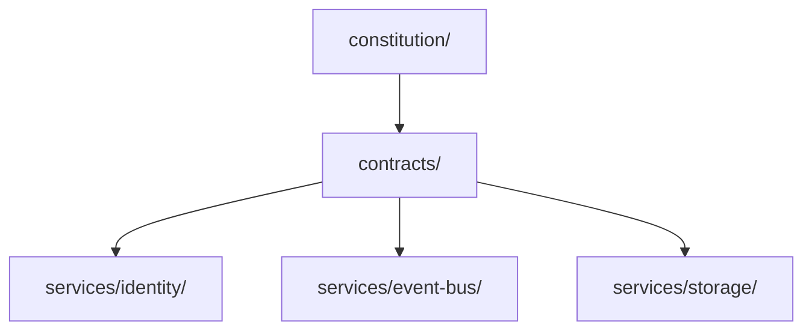

# Platform Substrate Dependencies

The platform substrate consists of Identity, Event Bus, and Storage.

## Allowed Dependencies

Services may depend on:

- `constitution/`
- `contracts/`

## Forbidden Dependencies

Services must not depend on:

- `engines/`
- `domains/`
- `internal/`
- `external/`

## Service Dependency Direction

## Service Contract Use

| Service | Canonical Contracts | Notes |
| --- | --- | --- |
| Identity | `contracts/identities/`, `contracts/schemas/` | Owns RID, aliases, namespaces, lifecycle, lookup, and merge language. |
| Event Bus | `contracts/events/`, `contracts/identities/`, `contracts/schemas/` | Uses identity references for event subjects and schema references for validation. |
| Storage | `contracts/storage/`, `contracts/identities/`, `contracts/events/`, `contracts/schemas/` | Uses identity references for ownership and event references for version/audit hooks. |

## Non-Goals

- No engine-specific behavior.
- No ARK refactor.
- No Jarvis modification.
- No database, broker, or identity provider selection.
- No business logic implementation.

## Wave 2 Addendum

The platform substrate now includes five promoted service owners:

- `services/identity/`
- `services/event-bus/`
- `services/storage/`
- `services/configuration/`
- `services/policy/`

These services may depend on constitutional documents and contracts only. Engines consume them in later implementation migrations after compatibility proofs.

