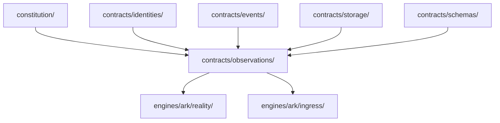
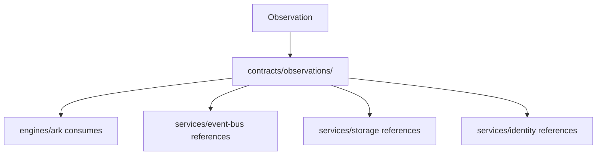

# Promotion Report: Observation Contract

## Summary

Concept promoted: Observation

Canonical owner: `contracts/observations/`

Promotion date: 2026-06-27

Scope: language-only contract promotion.

No runtime code was moved or changed.

## Discovery

Observation currently appears as ARK reality-preservation language and ingress
implementation evidence.

Primary evidence:

- `docs/constitutional-census.md`
- `engines/ark/docs/extraction-opportunities.md`
- `engines/ark/docs/inventory.md`
- `engines/ark/legacy/internal/ingestion/service.go`
- `engines/ark/legacy/ark-core/docs/ARK_TRUTH_SPINE.md`

## Inventory

| File | Relationship To Observation | Classification | Promotion Action |
| --- | --- | --- | --- |
| `engines/ark/docs/extraction-opportunities.md` | Names Observations as a contract extraction opportunity. | Governance evidence | Referenced as proof. |
| `engines/ark/docs/inventory.md` | Classifies ingest files as ARK ingress for observations/events. | Inventory evidence | Referenced as proof. |
| `engines/ark/legacy/internal/ingestion/service.go` | Contains ARK ingestion behavior and stability observation usage. | Engine behavior evidence | Not moved. |
| `engines/ark/legacy/ark-core/docs/ARK_TRUTH_SPINE.md` | Defines raw artifacts, spans, claims, provenance, and SSOT records. | Architecture evidence | Not moved. |
| `docs/constitutional-census.md` | Proposes `contracts/observations/` for observation language. | Census evidence | Updated confidence by successful promotion. |
| `contracts/observations/README.md` | New canonical observation language home. | Contract | Created. |

## Dependency Graph

## Ownership Graph

## Canonical Owner Verification

Observation is shared language. It must be consumed by ARK, Event Bus, Storage,
Identity, and future engines without being implemented by the contract.

Canonical owner: `contracts/observations/`

Confidence: High

## Migration Plan

1. Create `contracts/observations/README.md` as language-only contract surface.
2. Update ownership matrix with Observation contract ownership.
3. Register the promotion.
4. Update dashboard and scorecard.
5. Mark the relevant contract-gap debt as partially reduced.
6. Verify no implementation files exist under `contracts/observations/`.

## Execution

Created `contracts/observations/README.md`.

No ARK, Jarvis, Foundry, service, domain, internal app, external integration, or
operation implementation was modified.

## Behavior Preservation

Behavior is unchanged because this promotion adds documentation-only contract
language and moves no runtime code.

## Verification

Checks:

- `contracts/observations/` contains only `README.md`.
- Observation appears in `docs/ownership-matrix.md`.
- Promotion appears in `docs/promotion-registry.md`.
- Dashboard no longer lists Observation Contract as the next queued promotion.
- Architectural debt records DEBT-011 as partially reduced.
- Scorecard baseline acknowledges one contract-gap reduction.

## Rollback

Remove `contracts/observations/README.md` and revert the governance document
updates in this promotion.

Behavior rollback is not required because runtime behavior was unchanged.
