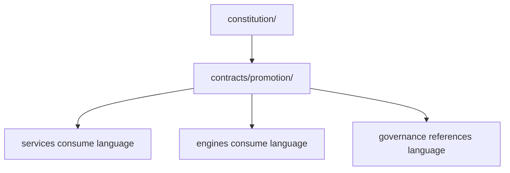
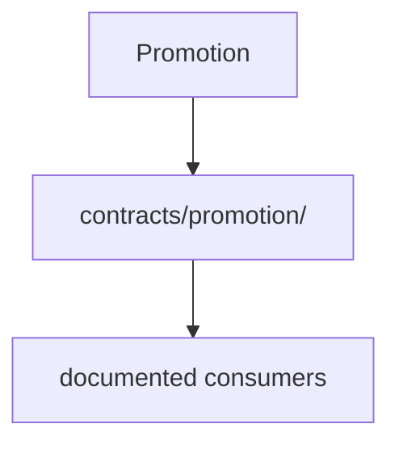

# Promotion Report: Promotion Contract

## Summary

Concept promoted: Promotion

Canonical owner: `contracts/promotion/`

Promotion date: 2026-06-27

Scope: language-only contract promotion.

No runtime code was moved or changed.

## Discovery

Existing language was discovered in the constitutional census, ownership matrix,
ARK legacy evidence, Jarvis navigation docs, Foundry legacy evidence, and current
contract/service scaffolds.

## Inventory

| Evidence | Relationship | Action |
| --- | --- | --- |
| `docs/constitutional-census.md` | Concept responsibility, duplication, proposed owner, and confidence evidence. | Referenced and updated. |
| `docs/ownership-matrix.md` | Canonical ownership evidence. | Updated. |
| `engines/ark/docs/inventory.md` | ARK file-level evidence for language and duplicates. | Referenced only. |
| `engines/ark/docs/extraction-opportunities.md` | Contract extraction evidence where applicable. | Referenced only. |
| `engines/ark/docs/duplicate-concepts.md` | Duplicate ownership evidence where applicable. | Referenced only. |
| `engines/jarvis/README.md` | Navigation and bearing evidence where applicable. | Referenced only. |
| `engines/foundry/README.md` | Engineering workflow consumer evidence where applicable. | Referenced only. |
| `contracts/promotion/README.md` | New or normalized canonical language home. | Created or updated. |

## Dependency Graph

## Ownership Graph

## Canonical Owner Verification

Promotion is shared architectural language. Its canonical contract home is
`contracts/promotion/`. Runtime behavior remains with future implementation owners and
existing legacy sources until later proof-backed promotions.

Confidence: High

## Migration Plan

1. Create or normalize `contracts/promotion/README.md` as language-only contract documentation.
2. Register the promotion.
3. Update ownership, census, dashboard, debt, and scorecard governance.
4. Verify the contract directory contains no executable implementation.

## Execution

Created or updated `contracts/promotion/README.md`.

No engine, service, domain, internal app, external integration, or operation
implementation was modified.

## Behavior Preservation

Behavior is unchanged because this promotion adds or normalizes documentation-only
contract language.

## Rollback

Revert `contracts/promotion/README.md` and this promotion's governance updates.
Runtime rollback is not required because runtime behavior was unchanged.
