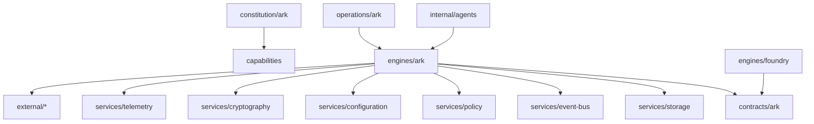

# ARK Dependency Graph

This graph is inferred from filenames, module ownership, and documented ARK architecture. It is a Phase 1 ownership graph, not a runtime call graph.

## Inferred Edges

| From | To | Evidence Files |
| --- | --- | --- |
| `constitution/ark` | `contracts/ark` | `AI_CONTRACT.md` |
| `constitution/ark` | `services/policy` | `ark-core/docs/MISSION_GRADE_RULES.md` |
| `contracts/ark` | `services/event-bus` | `ark/event_schema.py`, `internal/contracts/event_v1.json`, `tests/ark/test_event_schema.py` |
| `contracts/ark/definitions` | `contracts/ark` | `definitions/actions.yaml`, `definitions/meta.yaml`, `definitions/policies.yaml`, `definitions/routing.yaml` |
| `engines/ark/core` | `engines/foundry` | `ark/codegen_safe.py`, `ark/forge_planner.py` |
| `engines/ark/core` | `external systems` | `cmd/mqtt-bridge/main.go` |
| `engines/ark/core` | `services/event-bus` | `ark/gsb.py`, `ark/src/event/mod.rs`, `ark/src/event/wal.rs` |
| `engines/ark/docs/legacy` | `contracts/ark` | `internal/loop_contract.md` |
| `engines/ark/docs/legacy` | `engines/foundry` | `FORGE_START_HERE.md` |
| `engines/ark/docs/legacy` | `services/policy` | `policy/ARK_CONSTITUTION.md`, `policy/placement_rules.md` |
| `engines/ark/docs/legacy` | `services/storage` | `internal/state/README.md` |
| `engines/ark/ingress/.env.example` | `services/configuration` | `.env.example` |
| `engines/ark/legacy/ark-core/internal/epistemic/policy.go` | `services/policy` | `ark-core/internal/epistemic/policy.go` |
| `engines/ark/legacy/ark-core/internal/epistemic/states.go` | `services/storage` | `ark-core/internal/epistemic/states.go` |
| `engines/ark/legacy/internal/redteam/crypto.go` | `services/cryptography` | `internal/redteam/crypto.go` |
| `engines/ark/legacy/internal/wiring/mqttbridge.go` | `external systems` | `internal/wiring/mqttbridge.go` |
| `engines/ark/reality` | `services/event-bus` | `internal/models/event.go` |
| `engines/ark/tests` | `contracts/ark` | `ark-core/tests/test_docs_contracts.py`, `tests/ark/test_emitter_contracts.py`, `tests/ark/test_runtime_contracts.py` |
| `engines/ark/tests` | `engines/foundry` | `ark-core/tests/test_forge_banlist.py`, `ark-core/tests/test_forge_bootstrap.py`, `ark-core/tests/test_forge_browser.py`, `ark-core/tests/test_forge_diff_apply.py` |
| `engines/ark/tests` | `external systems` | `internal/wiring/mqttbridge_test.go`, `tests/agents/test_composio_agent.py`, `tests/emitters/test_homeassistant_emitter.py`, `tests/emitters/test_jellyfin_emitter.py` |
| `engines/ark/tests` | `services/configuration` | `tests/ark/test_config.py` |
| `engines/ark/tests` | `services/cryptography` | `ark-core/tests/test_forge_security.py`, `tests/ark/test_security.py` |
| `engines/ark/tests` | `services/event-bus` | `tests/ark/test_gsb.py` |
| `engines/ark/tests` | `services/storage` | `ark-core/internal/epistemic/states_test.go` |
| `engines/foundry/legacy` | `contracts/ark` | `ark-core/forge/mcp/contracts.py` |
| `engines/foundry/legacy` | `engines/foundry` | `Forge App.cmd`, `Forge App.ps1`, `Forge App.sh`, `ark-core/forge/__init__.py` |
| `engines/foundry/legacy` | `services/configuration` | `ark-core/forge/runtime/config.py` |
| `engines/foundry/legacy` | `services/policy` | `ark-core/forge/mcp/policy.py` |
| `external` | `external systems` | `emitters/homeassistant_emitter.py`, `emitters/jellyfin_emitter.py`, `emitters/unifi_emitter.py` |
| `external/composio` | `external systems` | `agents/composio/agent.py` |
| `internal/agents` | `engines/foundry` | `agents/forge_native/__init__.py`, `agents/forge_native/agent.py` |
| `operations/ark` | `engines/foundry` | `packaging/linux/forge-app.desktop.in`, `packaging/linux/forge-app.svg` |
| `operations/ark` | `external systems` | `Dockerfile.composio`, `Dockerfile.jellyfin-emitter`, `Dockerfile.mqtt-bridge`, `Dockerfile.unifi-emitter` |
| `operations/ark` | `services/configuration` | `authelia/configuration.yml` |
| `operations/ark` | `services/storage` | `Dockerfile.duckdb` |
| `operations/deployment/ark/.env.prod` | `services/configuration` | `.env.prod` |
| `services/configuration` | `services/policy` | `ark-core/config/operating_rules.json`, `ark-core/config/tiering_rules.json`, `config/tiering_rules.json` |
| `services/cryptography` | `services/configuration` | `internal/crypto/envelope.go` |
| `services/event-bus` | `services/configuration` | `config/nats.conf` |
| `services/event-bus` | `services/storage` | `internal/transport/redis.go`, `internal/transport/redis_test.go` |
| `services/policy/ark` | `services/policy` | `policy/ark_identity_rules.json`, `policy/ark_rules.json`, `policy/autonomy_rules.json`, `policy/autoscaler_rules.json` |
| `tooling/ark` | `services/configuration` | `scripts/ci/snapshot_config.sh` |
| `tooling/ark` | `services/policy` | `.cursorrules`, `scripts/ci/policy_gate.sh` |
