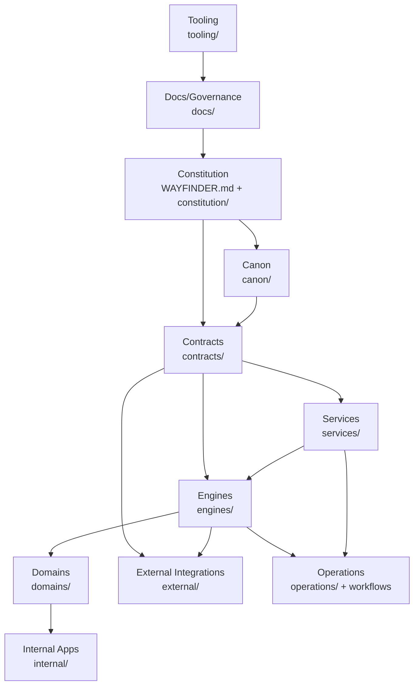

# Ownership Graph

## Repository Ownership

## Primary Owners

| Owner | Owns |
| --- | --- |
| Constitution | Laws, invariants, layer order, execution grammar, repository rules. |
| Canon | Names, aliases, ontology, deprecated term mapping. |
| Contracts | Stable protocol language and schemas. |
| Capabilities | Capability vocabulary. |
| Services | Shared infrastructure: identity, event bus, storage, configuration, policy. |
| ARK | Reality preservation, observation ingestion, preserved source relationships. |
| Interpretation | Candidate knowledge and governance. |
| Views | Retrieval and presentation projections. |
| Foundry | Proof-backed engineering change and Forge compatibility fold. |
| Jarvis/NOMAD/etc. | Named future participant or navigation engines as scaffolded. |
| Documentation/Governance | ADRs, reports, promotions, program plans. |
| Tooling | Repository analysis and export mining scripts. |
| Generated Knowledge | Derived knowledge artifacts, not canonical source truth. |
| Local Validation | Private validation evidence, not committed source authority. |

## Ownership Notes

- Each significant active component has one primary owner at the directory
  level.
- Legacy trees contain mixed responsibilities and are classified by preserved
  source location, not by decomposed future ownership.
- Generated artifacts are owned as artifacts, not as constitutional sources.
