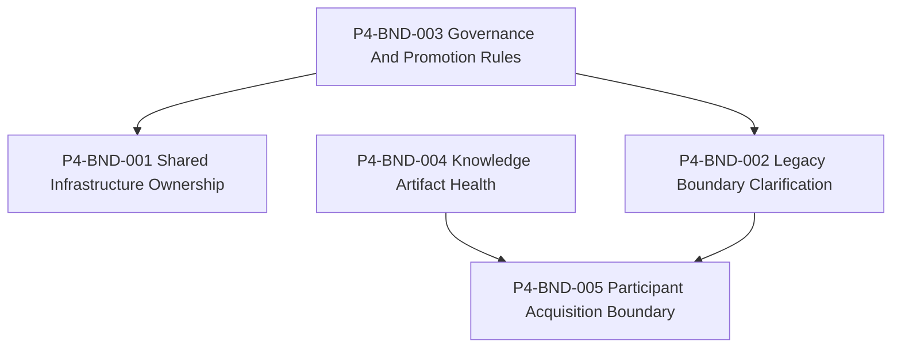

# Bundle Dependency Graph

## Graph

## Dependency Types

| Bundle | Required predecessors | Blocking bundles | Independent / parallel notes |
| --- | --- | --- | --- |
| P4-BND-001 Shared Infrastructure Ownership | Governance rules may clarify promotion/status vocabulary. | P4-BND-003 may block canonical status claims. | Can be analyzed in parallel if status claims remain caveated. |
| P4-BND-002 Legacy Boundary Clarification | Governance rules may clarify alias retirement and canonical ownership. | P4-BND-003 may block final alias lifecycle decisions. | Can proceed at cluster-boundary level without human decisions. |
| P4-BND-003 Governance And Promotion Rules | None inside P4. | Human decisions from P2.5 may block resolution. | Independent composition bundle. |
| P4-BND-004 Knowledge Artifact Health | None inside P4. | None observed. | Independent and parallelizable. |
| P4-BND-005 Participant Acquisition Boundary | Knowledge boundary and legacy/external boundary observations. | P4-BND-002 and P4-BND-004 may inform exact boundaries. | Can be analyzed in parallel as long as it remains boundary-only. |

## No Prioritization

Arrows record dependency relationships only. They do not imply priority,
schedule, effort, or execution order.
