# Polaris Master Roadmap — Shaped DAG Portfolio v1

Status: CANONICAL ACTIVE ROADMAP

## Portfolio law
The roadmap is not one mega-graph. It is a family of typed DAGs sharing stable node IDs and cross-DAG edges. Each graph uses the shape appropriate to its causal structure. Stable background is machine-readable/drillable; the human surface remains delta-only.

Roadmap node states: DISCOVERED, SPECIFIED, PLANNED, READY, IN_PROGRESS, VERIFIED, DEPLOYED, OPERATING, DEGRADED, BLOCKED, DEFERRED, SUPERSEDED, RETIRED, IMPOSSIBLE, N_A, UNKNOWN.

Every node carries: ID, owner, scope, objective, current state, next verified successor state, required parents/dependencies, blocker if any, verification receipt requirement, invalidation/revisit condition, and physical-guide link when physical.

---

# DAG A — Constitutional / Architecture Kernel
Shape: dependency DAG. Objective: preserve the narrow waist and prevent drift.

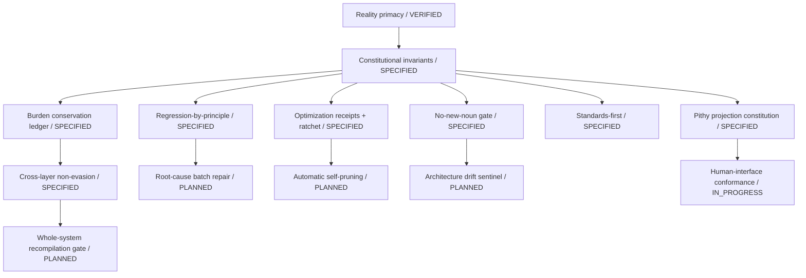

Successor state: architecture changes cannot land without invariant/burden/ownership checks. Verification: governance tests + release receipt.

---

# DAG B — Reality / Evidence / State / Decision Kernel
Shape: causal + derivation DAG. Objective: one universal world-model loop.

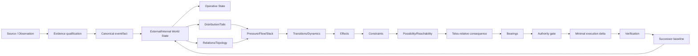

Roadmap state:
- B00-B02: IN_PROGRESS — shared acquisition/evidence substrate exists in pieces; reconcile into one owner.
- B03: SPECIFIED — External World State canonicalization and internal-state boundary require source consolidation.
- B04: SPECIFIED.
- B05-B08: SPECIFIED/IN_PROGRESS — sparse tensor/tail/transition operators exist conceptually; complete executable common library.
- B09-B13: SPECIFIED — preserve mission-relative interpretation bridge.
- B14: IN_PROGRESS — authority fabric exists but needs universal conformance.
- B15-B17: IN_PROGRESS — execution/closure persistence exists; unify successor-state verification.

Next verified successor: one end-to-end replay from source observation to verified successor state without domain-specific engine logic.

---

# DAG C — Semantic Shapes / Standards / Data Substrate
Shape: inheritance lattice + derivation DAG.

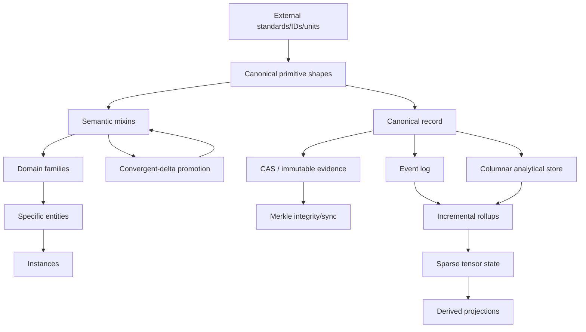

Nodes to finish:
- shared shapes: ENTITY/IDENTITY; STOCK/FLOW/BALANCE; RESOURCE/RESERVE/INVENTORY; PRODUCTION/TRANSFORMATION/LOSS/RECOVERY; CAPACITY/UTILIZATION/BOTTLENECK; SUPPLY/DEMAND/CLEARING/PRESSURE; PRICE/COST/VALUE; NETWORK/FLOW; LOCATION/GEOMETRY; POPULATION/COHORT; ORGANIZATION/AUTHORITY; ASSET/LIABILITY/CLAIM; RISK/HAZARD/EXPOSURE/LOSS; LIFECYCLE/TRANSITION; OBSERVATION/EVIDENCE/CONFIDENCE; DISTRIBUTION/TAIL; CONSTRAINT/PRESSURE/SLACK.
- standards mappings: units, geographic IDs, materials/commodities, financial instruments, building/electrical/plumbing/network interfaces, product identifiers.
- storage: RAW != NORMALIZED != DERIVED; acquire/store once; provenance preserved.

Next verified successor: adding a new commodity/entity requires only its semantic delta + source mappings, with no sibling field duplication.

---

# DAG D — Acquisition / Observation / Reality Intelligence
Shape: event-driven execution DAG.

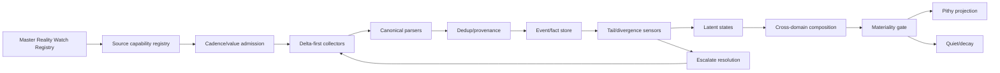

Coverage backlog adapters: weather/climate; ecology/ecoregions/watersheds/forestry; housing/land/development; demographics; economy/CoL; elections; government/civic capacity; infrastructure; insurance; health/emergency capacity; mobility/freight; tourism/culture; agriculture/food; energy; water; minerals/commodities; companies/markets; technology/capability ratchets; conservation/stewardship; Great Rebasement; products/procurement/ownership; legal; automotive; household; preparedness.

Next verified successor: three unrelated domains run through identical collectors/events/tails/composition machinery with only adapter deltas.

---

# DAG E — Human Interface / Jarvis / Attention Sovereignty
Shape: progressive-disclosure tree feeding action DAG.

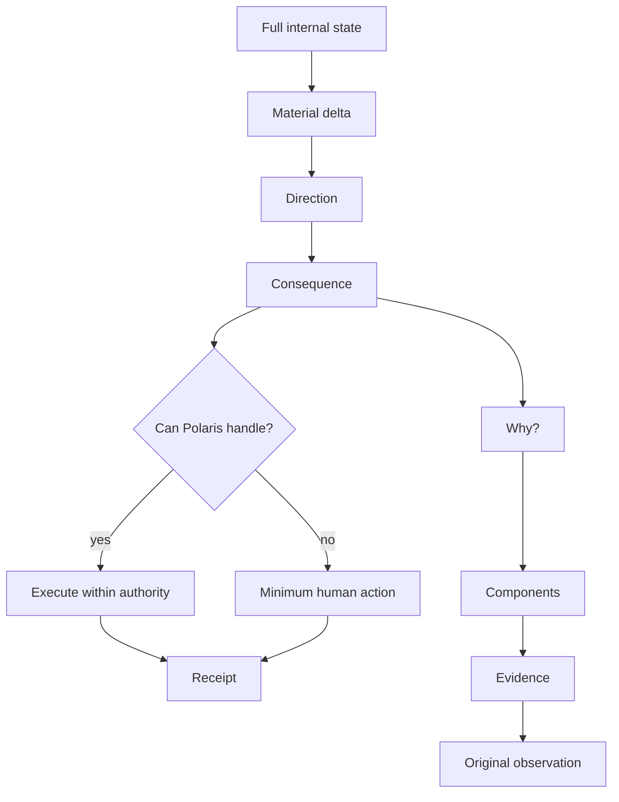

Program nodes:
- pithy delta-first app/report/voice projection — IN_PROGRESS.
- ontology-remembers-itself alias/natural-language resolver — SPECIFIED.
- <=2 navigation levels by default — SPECIFIED.
- Attention Sovereignty/Tail Delegation — SPECIFIED.
- Task Telos compilation — SPECIFIED.
- Universal Micro-Judgment Fabric — SPECIFIED.
- Task Execution Copilot — PLANNED/partial.
- notification suppression/materiality escalation — IN_PROGRESS.
- voice/audio Jarvis — PLANNED.
- user-controlled expansion/decompression — PLANNED.

Next verified successor: app, Wayfinder and Jarvis return the same minimum delta packet from one state source.

---

# DAG F — Software / Runtime / Basecamp / AMOS
Shape: deployment dependency DAG.

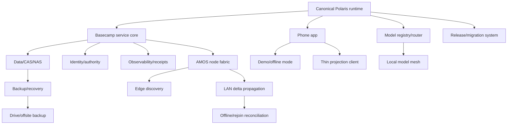

Known debt:
- exact historic alpha.237-248 semantics UNKNOWN.
- exact alpha.252-255 sequence UNKNOWN.
- alpha.259 release proof UNKNOWN.
- Finance->Wayfinder generic routing survival UNKNOWN.
- owned-item recall/news binding UNKNOWN.
- current native Android build proof UNKNOWN.

Next verified successor: clean reproducible Basecamp + Phone install can bootstrap, operate offline locally, reconcile on rejoin, and restore from backup.

---

# DAG G — Security / Privacy / Authority
Shape: authority graph + failure-containment DAG.

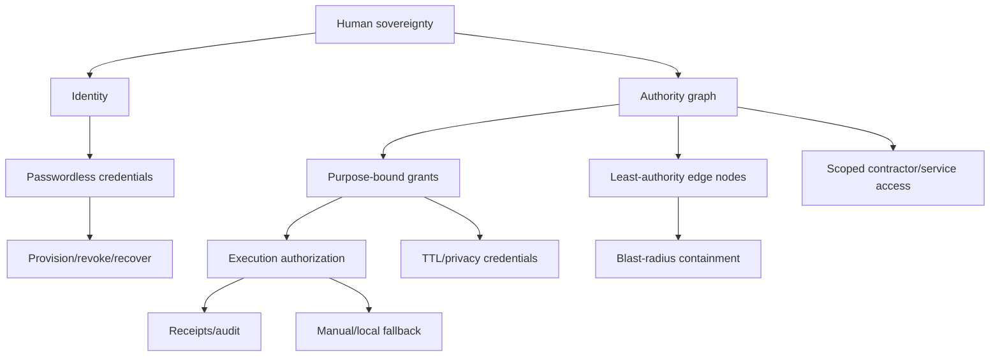

Roadmap nodes: local-first authentication; hard admin path; hardware segregation where justified; privacy browser/credential broker; credential loss/recovery; offline physical access; camera/privacy zoning; authority non-amplification tests; provider-independent fallback.

Next verified successor: loss of cloud/phone/edge node cannot amplify authority or block consequential local recovery.

---

# DAG H — Physical Polaris Deployment
Shape: staged successor-state DAG. Detailed guides live in the Physical Deployment Guide Registry.

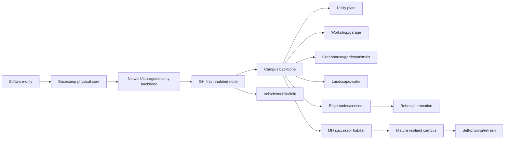

Timing shapes: RESERVE_DURING_DESIGN -> ROUGH_IN -> MOVE_IN_REQUIRED -> EARLY_OPERATION -> LATER -> ON_DEMAND; speculative hardware = NEVER_BY_DEFAULT.

Next verified successor: every physical node has commissioning, safe-state, maintenance, replacement and decommission receipts.

---

# DAG I — Sanctuary / Land / GH / Construction / MH
Shape: causal construction DAG with economic gates.

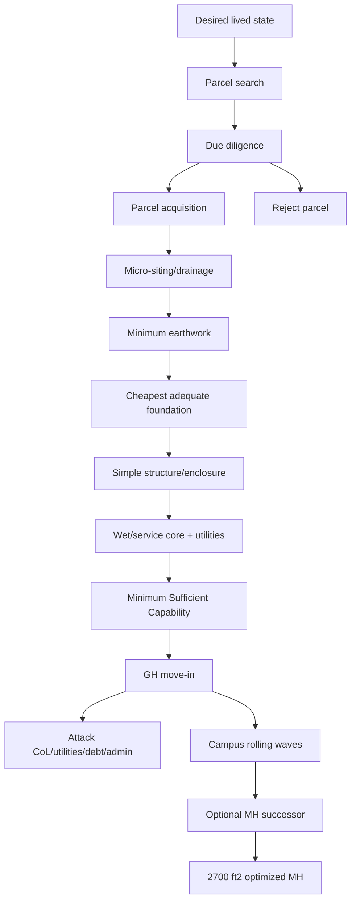

Construction compiler applied at every node: DELETE PARTS -> DELETE OPERATIONS -> DELETE UNIQUE DETAILS -> SIMPLIFY -> STANDARDIZE -> SHARE -> PASSIVE -> ASSIST NECESSARY WORK.

GH protected state: ~1,000 ft2 baseline/ceiling, test ~925-975 ft2; 2 bed/2 bath; no hallway by default; compact Wet Core; pantry wall; right-sized laundry; productive boundaries; passive logistics; simple shell; standards-first; no miniature-MH cleverness.

MH protected state: one story; ~2,700 ft2; 4 real bedrooms; halls where useful; accessible circulation/baths; library; craft; family capacity; acoustic/privacy separation; high storage; negative space; no forced transformer-house rituals.

Cost gates: whole-system installed cost; P50/P80/P95 separate; deferred != saved; avoided tail risk != invoice saving; liquidity reserve != project cost; no savings double counting.

Current actionable successor: qualify real parcels against GH footprint/covenants, soil/perc, water, access, drainage, build pad, utility path and total P80/P95 MSC burden.

---

# DAG J — Capital / Finance / Economic Intelligence
Shape: state + strategy + authority + execution DAG.

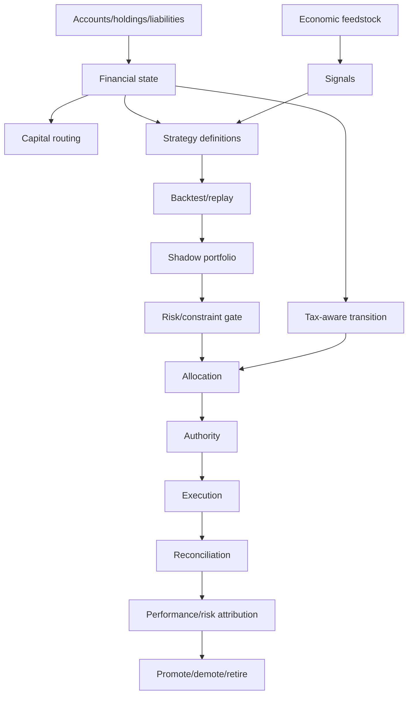

Nodes: passive obligation routing; emergency/goal/cash semantic separation; debt optimization; contribution-first rebalancing; Core 50; experimental sleeves; disclosure/copy/inverse/model strategies; shadow controls; tax-aware transitions; economic feedstock; personal finance integration; recurring bills/subscriptions; property/GH capital plan.

Next verified successor: all live strategy/action outputs derive from reconciled actual financial state + explicit authority, with shadow/control comparison and tax/transition costs preserved.

---

# DAG K — Wayfinder / Publications / Elections / External Bearings
Shape: acquisition -> composition -> publication DAG.

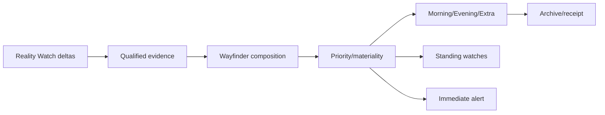

Programs: Navigator/Workshop/Garden/Gazette/Quartermaster; election-delta auto inclusion; demographics watch; property/local external bearings; finance folded where relevant; ICE Removal + Gap Mine; pithy delta-only output.

Next verified successor: publications are projections of shared reality state, not separate research/data stores.

---

# DAG L — Products / Ownership / Procurement / Physical Execution
Shape: lifecycle DAG.

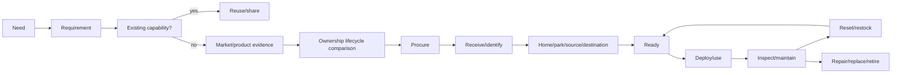

Programs: product/catalog delta discovery; unit economics; standards->bins->kits->modules->loadouts->stations; PACKOUT as implementation not ontology; automotive/workshop/home/garden/field workflows; time-envelope/friction compiler; recall/ownership watches; subscriptions/services/consumables.

Next verified successor: owned-item state automatically links maintenance, recall, consumables, replacement and deployment guides without duplicate databases.

---

# DAG M — Household / Food / Garden / Life Operations
Shape: material-flow + recurring workflow DAG.

Programs: procurement hierarchy/two-source rule; pantry/inventory; recipes; sauces/ferments/dairy/meat/preservation; zero-waste; laundry/cleaning/hygiene; greenhouse/garden/food forest; animals; household transformation fabric; Sanctuary rituals.

Next verified successor: recurring household administration compiles into low-attention loadouts/routines with material balance and replenishment paths.

---

# DAG N — Preparedness / Resilience / Recovery
Shape: consequence x failure x recovery DAG.

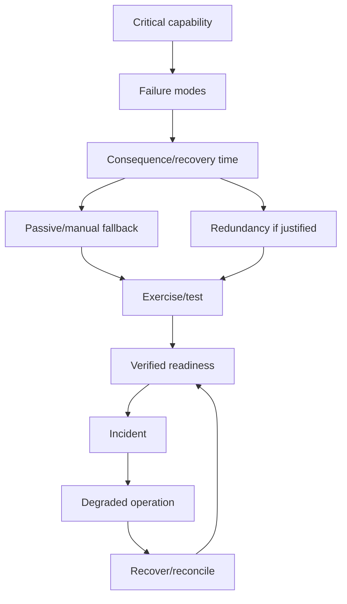

Programs: water, power, thermal, lighting, communications, medical/first aid, fire/weather, vehicle/field bags, 3-day disappearance capability, offline docs/maps, critical spares, recovery drills.

Next verified successor: every consequential fallback is exercised and has a real recovery receipt rather than paper redundancy.

---

# DAG O — Release / Migration / Backfill / Historical Debt
Shape: release qualification DAG.

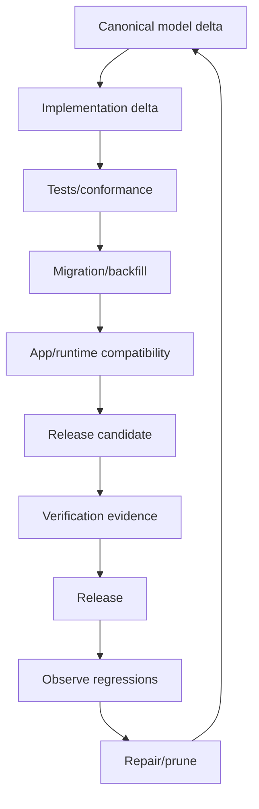

Explicit historical debt nodes:
- O20 alpha.237-248 exact semantics — UNKNOWN; blocker: missing exact canonical reconstruction.
- O21 alpha.252-255 exact sequence — UNKNOWN.
- O22 alpha.259 source/release proof — UNKNOWN.
- O23 Finance->Wayfinder routing survival — UNKNOWN.
- O24 owned-item recall/news binding — UNKNOWN.
- O25 native Android build proof — UNKNOWN.
- O26 branch/release divergence prevention — IN_PROGRESS; successor: every vNext branch forks/rebases from current accepted base with minimal delta.
- O27 backup continuity to Drive/offsite — IN_PROGRESS.

No version label promotes UNKNOWN implementation to VERIFIED.

---

# DAG P — Roadmap / Mining / Reconciliation Itself
Shape: ingestion/reconciliation DAG.

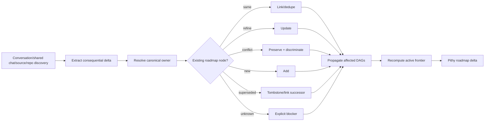

Next verified successor: mining cannot produce a consequential concept that lacks roadmap ownership/state after reconciliation.

---

# Cross-DAG typed edges
Allowed cross-links are explicit, not graph collapse:
- REQUIRES: target cannot advance without source.
- FEEDS: evidence/state signal contributes but does not gate.
- CONSTRAINS: source limits target possibility/authority.
- IMPLEMENTS: runtime/physical mechanism implements model capability.
- PROJECTS: UI/report is a view of canonical state.
- VERIFIES: receipt/evidence qualifies target state.
- SUPERSEDES: replacement relation.
- DEPLOYS_AT: semantic capability -> physical scope.
- FINANCES: capital state enables physical/software work.
- INVALIDATES: changed reality forces recompilation.

Highest-value cross-links:
A -> all DAGs: constitutional invariants constrain every change.
B -> D/E/I/J/K: world state feeds intelligence, human bearings, land/build, capital, publications.
C -> B/D/F/J/L: shared shapes/data substrate prevent domain duplication.
E -> F/K: all human projections obey pithy contract.
F -> D/E/G/H/K: Basecamp/runtime hosts observation, Jarvis, authority, physical nodes, Wayfinder.
G -> F/H/J/L: authority gates software, physical actuation, finance and procurement.
I -> H/J: land/GH/MH deployment requires physical guides and capital.
O -> all implemented DAGs: release qualification verifies actual propagation.
P -> all DAGs: mining/reconciliation updates roadmap state.

---

# Active frontier — next globally useful successor states
1. ROADMAP POPULATION VERIFIED: machine representation matches this portfolio; acyclic within each DAG; cross-links typed.
2. CONSTITUTIONAL ENFORCEMENT VERIFIED: architecture changes run invariant/burden/roadmap gates automatically.
3. UNIVERSAL REALITY LOOP VERIFIED: three different domains traverse the same source->state->bearing path.
4. ONE TRUTH / MANY VIEWS VERIFIED: App, Jarvis and Wayfinder project shared canonical state.
5. REPRODUCIBLE BASECAMP + PHONE VERIFIED: local bootstrap, offline operation, backup/restore, rejoin.
6. LAND/GH DECISION-GRADE: real candidate parcels qualified through covenants, soil/perc, water, access, drainage, pad, utilities and P80/P95 MSC burden.
7. PHYSICAL GUIDE COMPLETENESS: every manifestable capability resolves to guide/N_A/deferred/blocked.
8. HISTORICAL DEBT TRIAGE: exact unknown releases remain explicit and are either reconstructed, superseded with receipts, or retired.
9. SELF-PRUNING VERIFIED: replacements automatically identify redundant doctrine/code/roadmap nodes.

## Final law
THE ROADMAP IS A SET OF SHAPED, TYPED, INTEROPERABLE DAGs. EACH DAG PRESERVES ITS OWN CAUSAL SEMANTICS. CROSS-DAG RELATIONS LINK THEM WITHOUT CREATING A MEGA-GRAPH. NOTHING CONSEQUENTIAL MAY REMAIN ONLY IN CONVERSATION.