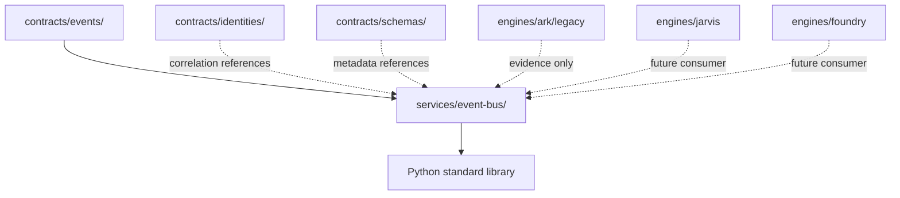

# Event Bus Implementation Proof

Date: 2026-06-27

## Scope

Promote one executable Event Bus implementation into `services/event-bus/` without migrating engines, selecting a broker, or changing runtime behavior.

## Harvested Behavior

| Legacy Evidence | Reusable Behavior | Promoted Location |
| --- | --- | --- |
| `engines/ark/legacy/ark/event_schema.py` | event ID, event type, source, timestamp, payload, tags, payload limits | `services/event-bus/event_bus_service.py` `EventEnvelope` and validation |
| `engines/ark/legacy/ark/subjects.py` | dot-delimited route subjects, `*` single-token wildcard, `>` trailing multi-token wildcard | `normalize_route` and `route_matches` |
| `engines/ark/legacy/internal/contracts/event_v1.json` | versioned event shape with event type, event ID, sequence, created time, CID, payload | `EventEnvelope`, publish sequence, replay cursor |
| `engines/ark/legacy/internal/models/event.go` | canonical ingestion event sequence and attributes | append-only in-memory log and metadata |
| `engines/ark/legacy/internal/transport/nats_test.go` | publish/request behavior is transport-level and must not be owned by service proof | Transport is intentionally not selected |

## Inventory

- `services/event-bus/event_bus_service.py`
- `services/event-bus/tests/test_event_bus_service.py`
- `services/event-bus/docs/implementation-proof.md`

## Dependency Graph

`services/event-bus/event_bus_service.py` imports only Python standard-library modules. It does not import engines, domains, internal applications, external integrations, operations, or contracts as runtime code.

## Consumer Graph

Current consumers remain unchanged. Future consumers may include ARK ingestion and replay, Jarvis navigation events, Foundry task verification events, MICE commitment events, operations audit streams, and external integration adapters.

## Duplicate Analysis

This proof reduces duplicate reusable event mechanics by giving Wayfinder a canonical executable home for:

- transport-neutral event envelopes
- route normalization
- ARK/NATS-style wildcard route matching
- bounded publish/subscribe mechanics
- correlation and causation metadata
- sequence-based replay cursors
- bounded health reporting

ARK's NATS transport, JetStream configuration, broker request/reply behavior, and engine workflow interpretation were not moved because those are transport, operations, or engine-specific concerns.

## Ownership Validation

- Canonical owner: `services/event-bus/`
- Contract language owner: `contracts/events/`
- Previous implementation evidence: ARK event schema, subjects, JSON event contract, Go event model, and NATS tests
- Engine-specific behavior retained in engines: observations, evidence, reality graph, broker-specific transport, ingestion leadership, and domain interpretation

## Verification

| Check | Result |
| --- | --- |
| Syntax verification | Pass: `python3 -m py_compile services/event-bus/event_bus_service.py` |
| Service tests | Pass: `python3 -m pytest -q -s services/event-bus/tests/test_event_bus_service.py` -> 8 passed |
| Legacy smoke tests | Pass: `PYTHONPATH=engines/ark/legacy python3 -m pytest -q -s engines/ark/legacy/tests/ark/test_event_schema.py engines/ark/legacy/tests/ark/test_subjects.py` -> 45 passed |
| Engine files moved | No |
| Engine imports from service required | No |
| Contracts executable code added | No |
| Service imports engine code | No |
| Concrete broker selected | No |

## Rollback Plan

1. Remove `services/event-bus/event_bus_service.py`.
2. Remove `services/event-bus/tests/test_event_bus_service.py`.
3. Remove this implementation proof and the Event Bus implementation rows from governance artifacts.
4. No runtime rollback is required because no engine consumer was rewired.
