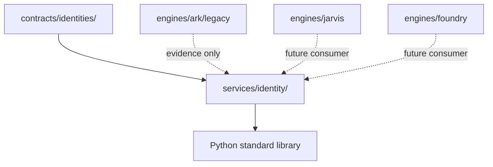

# Identity Implementation Proof

Date: 2026-06-27

## Scope

Promote one executable Identity implementation into `services/identity/` without migrating engines or changing runtime behavior.

## Harvested Behavior

| Legacy Evidence | Reusable Behavior | Promoted Location |
| --- | --- | --- |
| `engines/ark/legacy/ark-core/internal/models/truth_spine.go` `Entity` | canonical identity record with ID, type, aliases, label, confidence | `services/identity/identity_service.py` `IdentityRecord` |
| `engines/ark/legacy/ark/security.py` `request_id_middleware` | preserve inbound `X-Request-ID`; otherwise generate `secrets.token_hex(8)` | `services/identity/identity_service.py` `generate_request_id` |
| `contracts/identities/README.md` | RID, namespace, alias, canonical RID, lifecycle, merge language | `services/identity/identity_service.py` bounded resolver/merge primitives |

## Inventory

- `services/identity/__init__.py`
- `services/identity/identity_service.py`
- `services/identity/tests/test_identity_service.py`
- `services/identity/docs/implementation-proof.md`

## Dependency Graph

`services/identity/identity_service.py` imports only Python standard-library modules. It does not import engines, domains, internal applications, external integrations, operations, or contracts as runtime code.

## Consumer Graph

Current consumers remain unchanged. Future consumers may include ARK reality/evidence records, Jarvis navigation subjects, Foundry execution attribution, Event Bus metadata, and Storage object metadata.

## Duplicate Analysis

This proof reduces duplicate reusable identity mechanics by giving Wayfinder a canonical executable home for:

- request/correlation identity generation behavior
- canonical alias-aware identity records
- alias resolution
- namespace validation
- deterministic merge decisions
- bounded health reporting

ARK's NATS subject modules were not moved because discovery showed they are Event Bus routing concerns, not Identity implementation.

## Ownership Validation

- Canonical owner: `services/identity/`
- Contract language owner: `contracts/identities/`
- Previous implementation evidence: ARK truth-spine entity model and request ID middleware
- Engine-specific behavior retained in engines: observations, evidence, reality graph, event subjects, NATS transport, and domain interpretation

## Verification

| Check | Result |
| --- | --- |
| Syntax verification | Pass: `python3 -m py_compile services/identity/identity_service.py services/identity/__init__.py` |
| Service tests | Pass: `python3 -m pytest -s services/identity/tests/test_identity_service.py` -> 8 passed |
| Legacy smoke test | Pass: `PYTHONPATH=engines/ark/legacy python3 -m pytest -s engines/ark/legacy/tests/ark/test_subjects.py` -> 26 passed |
| Engine files moved | No |
| Engine imports from service required | No |
| Contracts executable code added | No |
| Service imports engine code | No |

## Rollback Plan

1. Remove `services/identity/__init__.py`.
2. Remove `services/identity/identity_service.py`.
3. Remove `services/identity/tests/test_identity_service.py`.
4. Remove this implementation proof and the Identity implementation rows from governance artifacts.
5. No runtime rollback is required because no engine consumer was rewired.
