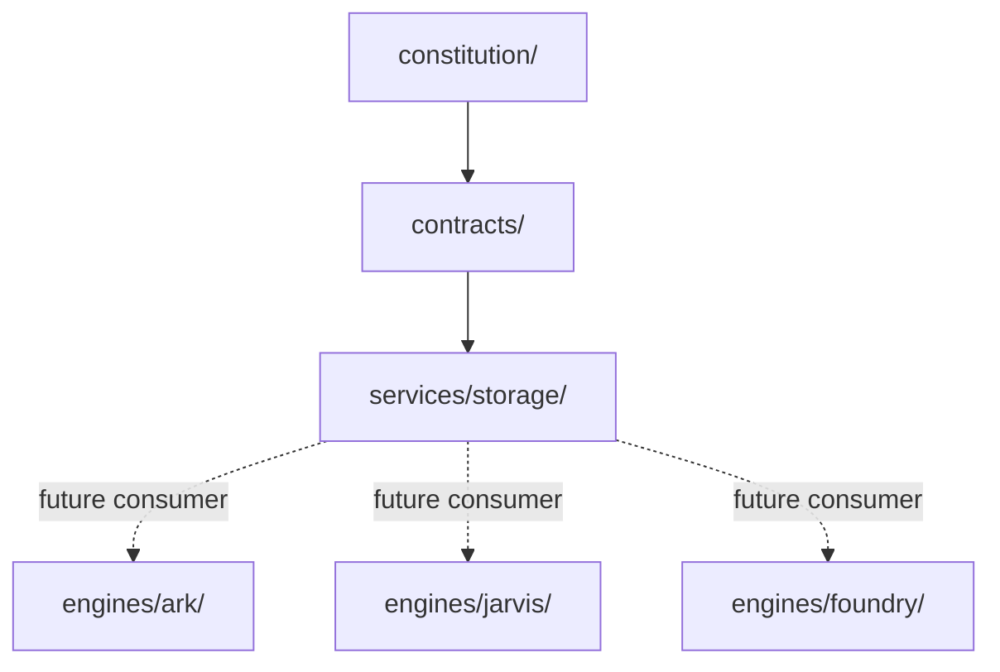

# Storage Service Dependency Graph

## Allowed Inbound References

Engines, domains, internal applications, and operations may consume this service through public contracts.

## Forbidden Outbound References

`services/storage/` must not depend on engines, domains, internal applications, external integrations, or operations.
